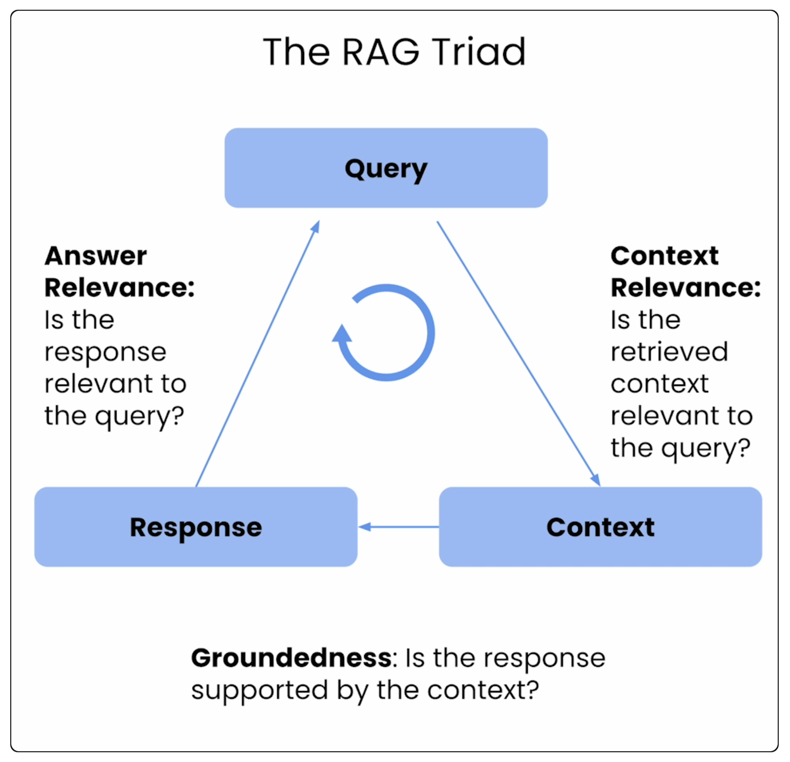
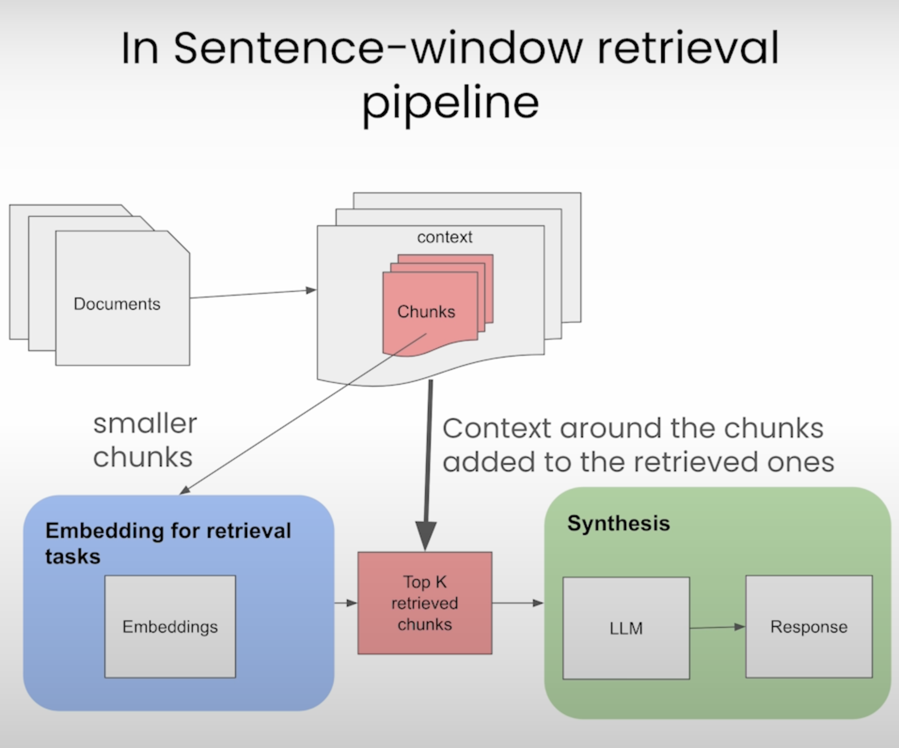

# DeepLearning.AI Short Course: Building and Evaluating Advanced RAG

Started course: 2024/04/23
Taught by: Jerry Liu (**LlamaIndex**) and Anupam Datta (**Truera**)

## Introduction

* **Sentence-window** retrieval and **auto-merging retrieval** may yield better performance than simpler RAG methods

* Useful RAG metrics include **context relevance**, **groundedness**, and **answer relevance**

## Section 1: Advanced RAG Pipeline

* Three components of RAG pipeline:
    1. **Ingestion**: `documents` -> `chunks` -> `embeddings` -> `index`
    2. **Retrieval**: `query` -> `index` -> `top k...`
    3. **Synthesis**: ( `query`, `top k...` ) -> `LLM` -> `Response`

* We're going to set up a basic and advanced RAG pipeline with **LlamaIndex** and an evaluation benchmark with **TruEra**

* **Direct query engine**: how to index and query using `VectorStoreIndex` from `llama_index`: 
    ```py
    from llama_index import Document, ServiceContext, SimpleDirectoryReader, VectorStoreIndex
    from llama_index.llms import OpenAI

    documents = SimpleDirectoryReader(
        input_files=["./eBook-How-to-Build-a-Career-in-AI.pdf"]
    ).load_data()

    document = Document(text="\n\n".join([doc.text for doc in documents]))

    llm = OpenAI(model="gpt-3.5-turbo", temperature=0.1)

    service_context = ServiceContext.from_defaults(
        llm=llm, embed_model="local:BAAI/bge-small-en-v1.5"
    )
    index = VectorStoreIndex.from_documents([document],
                                            service_context=service_context)
    
    query_engine = index.as_query_engine()

    response = query_engine.query(
        "What are steps to take when finding projects to build your experience?"
    )
    ```
    - Note we're using ChaptGPT 3.5 Turbo for LLM and Hugging Face tokenizer
    - `VectorStoreIndex#from_documents` does chunking, embedding, and indexing all at once
    - `VectorStoreIndex.as_query_engine` provides a query engine

* The **RAG triad**, along with three evaluation metrics:
    

* Note that our initial simple RAG had decently high groundedness (0.8) and answer relevance (0.93), but poor context relevance (0.26). We'll use more advanced techniques to see if we can get better results.

* **Sentence window retrieval**: replace retrieved sentence with a larger window of surrounding content, to provide more context
    ```py
    from llama_index.llms import OpenAI
    from utils import build_sentence_window_index, get_sentence_window_query_engine

    llm = OpenAI(model="gpt-3.5-turbo", temperature=0.1)

    sentence_index = build_sentence_window_index(
        document,
        llm,
        embed_model="local:BAAI/bge-small-en-v1.5",
        save_dir="sentence_index"
    )

    sentence_window_engine = get_sentence_window_query_engine(sentence_index)

    response = sentence_window_engine.query(
        "how do I get started on a personal project in AI?"
    )
    ```
    - For our example, the sentence window retriever is providing better groundedness (.88 instead of .80), better context relevance (.34 instead of .26), and at lower cost (0.0009 vs 0.003)

* **Auto-merging retrieval**: construct a hierachy (e.g., chunk of size 512) with children nodes (e.g., chunks of size 128). If a parent has majority of children nodes retrieved, we'll replace children nodes with parent node.
    - For our example, the automerging query engine is better across the board

| Architecture | Groundedness | Answer Relevance | Context Relevance | Total Cost |
| ------------ | ------------ | ---------------- | ----------------- | ---------- |
| Direct Query Enging | 0.80 | 0.93 | 0.26 | 0.003 |
| Sentence Window Query Engine | 0.88 | 0.93 | 0.38 | 0.0009 |
| Auto-merging Query Engine | 1.00 | 0.94 | 0.44 | 0.0008 |

## Section 2: RAG Triad of metrics

* Using `trulens_eval` package

* RAG triad:
    1. **Answer Relevance**: is the final response useful?
    2. **Context Relevance**: how relevant is the content retrieved from the vector database?
    3. **Groundedness**: is the response supported by the context

* A **feedback function** provides a score (0-1.0) after reviewing an LLM's input, outputs, and intermediate response

* Using "Relevance (or groundedness) with chain-of-thought reasoning" to get an explaination from feedback function

* General process to evaluate and iterate on RAGs:
    1. Start with LlamaIndex basic RAG
    2. Evaluate with TruLens RAG Triad
        - Failure modes related to context size (too small)
    3. Iterate with LlamaIndex sentence window RAG
    4. Re-evaluate with TruLens RAG Triad
        - Do we see improvements in Context Relevance?
        - What about other metrics
    5. Experiment with different window sizes
        - What window size results in the best eval metrics?
        - Too small: insufficient context
        - Too big: irrelevant context


* Options for evaluations
    - **Ground Truth Evals**: scored by human experts
    - **Human Evals**: similar to "Ground Truth Evals", but users not necessarily experts (so degree of confidence is lower)

* In general human evals agree ~80% of time, and LLMs agree with human evals ~80% of time; suggesting LLM evals and human evals have comparable meaningfulness

* Other types of evaluation supported by TruLens:
    

* TrueLens supports a DataFrame-based leaderboard as well as a web-based dashboard:
    

## Section 3: Sentence-window retrieval

* Variables:
    - `window size`: number of sentences to provide. (E.g., 3 would provide 1 sentence before and 1 sentence after)

* Sentence-window RAG pipeline:
    

* Key components of Sentence-window RAG pipeline:
    * `Document`
    * `SentenceWindowNodeParser`: parses document by sentences, and provides a configurable window of n sentences as metadata
    * `ServiceContext` loads LLM, embedding model, and the node parser
    * `VectorStoreIndex.from_documents`
    * `MetadataReplacementPostProcessor`: places node with metadata (in our case, the sentence window)
    * `SentenceTransformerRerank`: reorders retrieved nodes based on relevance as determined by a specialized model

```py
import os
from llama_index import ServiceContext, VectorStoreIndex, StorageContext
from llama_index.node_parser import SentenceWindowNodeParser
from llama_index.indices.postprocessor import MetadataReplacementPostProcessor
from llama_index.indices.postprocessor import SentenceTransformerRerank
from llama_index import load_index_from_storage


def build_sentence_window_index(
    documents,
    llm,
    embed_model="local:BAAI/bge-small-en-v1.5",
    sentence_window_size=3,
    save_dir="sentence_index",
):
    # create the sentence window node parser w/ default settings
    node_parser = SentenceWindowNodeParser.from_defaults(
        window_size=sentence_window_size,
        window_metadata_key="window",
        original_text_metadata_key="original_text",
    )
    sentence_context = ServiceContext.from_defaults(
        llm=llm,
        embed_model=embed_model,
        node_parser=node_parser,
    )
    if not os.path.exists(save_dir):
        sentence_index = VectorStoreIndex.from_documents(
            documents, service_context=sentence_context
        )
        sentence_index.storage_context.persist(persist_dir=save_dir)
    else:
        sentence_index = load_index_from_storage(
            StorageContext.from_defaults(persist_dir=save_dir),
            service_context=sentence_context,
        )

    return sentence_index


def get_sentence_window_query_engine(
    sentence_index, similarity_top_k=6, rerank_top_n=2
):
    # define postprocessors
    postproc = MetadataReplacementPostProcessor(target_metadata_key="window")
    rerank = SentenceTransformerRerank(
        top_n=rerank_top_n, model="BAAI/bge-reranker-base"
    )

    sentence_window_engine = sentence_index.as_query_engine(
        similarity_top_k=similarity_top_k, node_postprocessors=[postproc, rerank]
    )
    return sentence_window_engine

from llama_index.llms import OpenAI

index = build_sentence_window_index(
    [document],
    llm=OpenAI(model="gpt-3.5-turbo", temperature=0.1),
    save_dir="./sentence_index",
)

sentence_window_engine = get_sentence_window_query_engine(index, similarity_top_k=6)

response = sentence_window_engine.query(
    "What are the keys to building a career in AI?"
)
```

* Tradeoffs when adjust sentence window size:
    1. Token usage/cost vs context relevance
    2. Larger window size vs. groundedness
    - Not that while context relevance and groundness are generally correlated at smaller window sizes (e.g., both low or high), as the window size gets higher the context relevance can stay high while the groundness decreases, as the LLM is overwhelmed by context, leading it to fall back on its pre-existing knowledge from its training

* Gradually increasing sentence window starting with 1, and tracking experiments to pick the best sentence window size

## Section 4: Auto-merging retrieval

## Conclusion