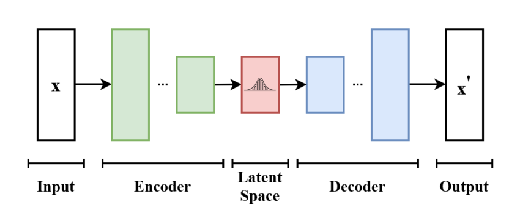

# Vector Databases: from Embeddings to Applications

## Introduction

* RAG used to overcome inability of LLMs to consider recent or proprietary data without retraining
* Vector databases proceed LLMs, long used for semantic search and recommendation systems

## How to Obtain Vector Representations of Data

* **Autoencorder**: used to encode inputs (e.g., Mnist handwritten digits) into embeddings
    

* Using `sentence_transformers.SentenceTransformer` to generate embeddings for sentences

* Ways to find the distance between embeddings:

    | Method | Description | Formula | Numpy | Interpretation |
    | ------ | ----------- | ------- | ----- | -------------- |
    | **Euclidean Distance** (L2) | shortest distance between two points or vectors | `√(∑(x-y)^2)` | `np.linalg.norm(a-b), ord=2)` | lower = better match |
    | **Manhattan Distance** (L1) | distance between two points if can only move one axis at a time | `√(∑|x - y|)` | `np.linalg.norm(a-b), ord=1)` | lower = better match |
    | **Dot Product** | measures the magnitude of the projection of one vector onto the other | `A • B = ∑A*B` | `np.dot(A, B)` | higher = better match (negative values mean far away) |
    | **Cosine Distance** | measures the difference in directionality (the angle) between vectors | `1 - (A • B) / (`&#124;&#124;`A`&#124;&#124;` `&#124;&#124;`B`&#124;&#124;`)` | `1 - (np.dot(vec1, vec2) / (np.linalg.norm(vec1) * np.linalg.norm(vec2)))` | lower = better match |

* Dot product and cosine distance are commonly used in NLP (i.e., with sentence embeddings)

## Search for Similar Vectors

## Approximate Nearest Neighbors

## Vector Databases

## Sparse, Dense, and Hybrid Search

## Application - Multilingual Search

## Conclusion 

