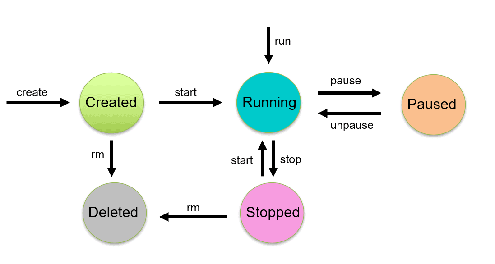

# Section 2: Manipulating Containers with the Docker Client

* Starting a container:
    ```bash
    % # To run containers
    % docker run busybox                 # docker run <image-name> 
    % docker run busybox echo 'hi there' # docker run <image-name> <command>
    hi there
    ```

* To view containers:
    ```bash
    % docker ps         # list all running containers
    % docker ps --all   # list all containers that aren't deleted

* `docker run` = `docker create` (create container) + `docker start` (start container):
    ```bash
    % # Instead of `run`, can use `create` + `start` 
    % docker create hello-world
    9e0960a5d0aec7701534ed2ef92cfdf46ba7477f0630fbb3f65cbdd47cde29d3
    % docker start -a 9e0960a5d0aec7701534ed2ef92cfdf46ba7477f0630fbb3f65cbdd47cde29d3 # console output
    ```

* Unlike `docker run`, by default `docker start` doesn't show output; use `-a` flag to **attach** standard out and error to view logs

* Container lifecycle [source](https://k21academy.com/docker-kubernetes/docker-container-lifecycle-management/):
    

* To delete stopped containers, build cache, and other resources:
    ```bash
    % docker system prune
    ```

* Stopping (or killing) a running container using `docker stop` (or `docker kill`):
    ```bash
    % docker create busybox ping www.google.com
    73f910719b315508ee5479460df9252741cf0dbeb1996dd0f6e9ac47687b671f
    % docker start 73f910719b315508ee5479460df9252741cf0dbeb1996dd0f6e9ac47687b671f
    % docker logs 73f910719b315508ee5479460df9252741cf0dbeb1996dd0f6e9ac47687b671f
    % docker stop 73f910719b315508ee5479460df9252741cf0dbeb1996dd0f6e9ac47687b671f # passes SIGTERM
    % # `docker kill <id>` to pass a SIGKILL
    ```

* Executing commands in a running container using `docker exec -it`:
    ```bash
    % docker run redis
    % docker ps         # find the container ID
    CONTAINER ID   IMAGE     COMMAND                  CREATED          STATUS          PORTS      NAMES
    f4f0eda5a955   redis     "docker-entrypoint.s…"   23 seconds ago   Up 22 seconds   6379/tcp   confident_wright
    % # start redis-cli...
    % docker exec -it f4f0eda5a955 redis-cli        # '-i' interactive (stdin), '-t' tty 
    127.0.0.1:6379> set myvalue 5
    OK
    127.0.0.1:6379> get myvalue
    "5"
    127.0.0.1:6379> # ctrl-c to exit
    ```

* To start a terminal within a running container:
    ```bash
    % docker exec -it f4f0eda5a955 sh
    # pwd
    /data
    # # CTRL-D to exit
    ```

* To run a container and create a shell:
    ```bash
    % docker run -it busybox sh
    ```