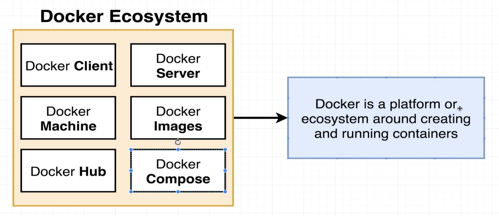
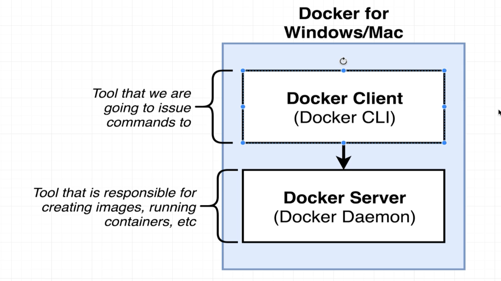

## Section 1: Dive Into Docker!

* Docker makes it really easy to install and run software without worrying about setup or dependencies

* **Docker** is an ecosystem of tools:
    

* A basic description of images and containers:
    - An **image** is a single file with all the dependencies and config required to run a program
    - A **container** is an instance of an image

* Docker for Mac:
    

* **Docker Hub**: a public container image registry

* To get started with Docker:
    1. Create an account on [Docker Hub](https://hub.docker.com/)
    2. Install Docker for Mac
    3. Log into the Docker Hub registry:
        ```bash
        % docker login # use username and password from Docker Hub
        ```
    4. Run the following commands to validate the installation:
        ```bash
        % docker version
        % docker run hello-world # Hello from Docker!
        ```

* When running a command, the **Docker Daemon** will first look in the local **image cache**, then look in configured registries (e.g., Docker Hub)

* With operating systems, applications make **system calls** to the **kernel** to gain access to system resources

* Linux operating systems support:
    1. **Namespacing**, which isolates resources (e.g., processes, hard drive, network, users, hostnames, inter process communication) per process 
    2. **Control Groups** (**cgroups**): limit amount of resources (memory, CPU usage, HD I/O, network bandwidth) used per process 

* A more in-depth description of containers and images:
    - A **container** is essentially a process that uses namespacing and cgroups
    - An **image** is essentially a filesystem snapshot and a startup command

* Docker for Mac installed a Linux Virtual Machine, and all of the containers are created inside the Linux Virtual Machine, with the Linux Kernel
    - If you run `docker version`, you'll see the Linux Kernel (e.g., `linux/arm64`)