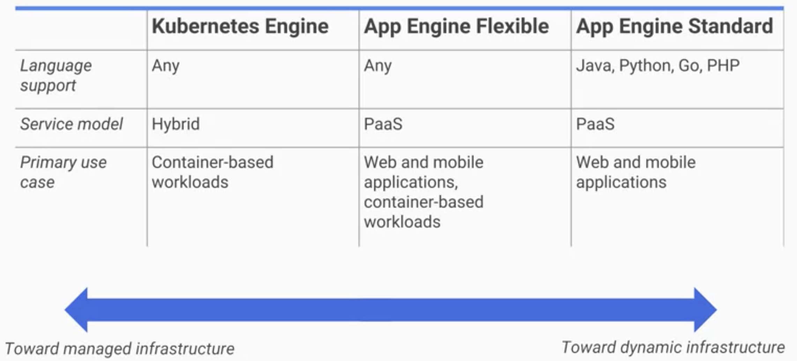
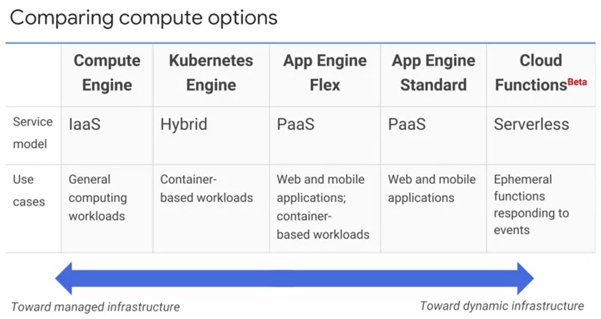
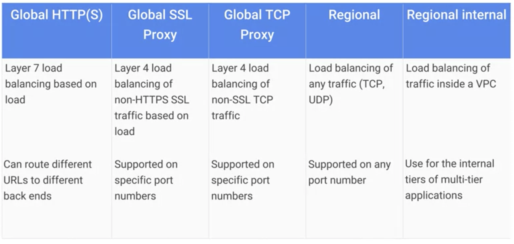
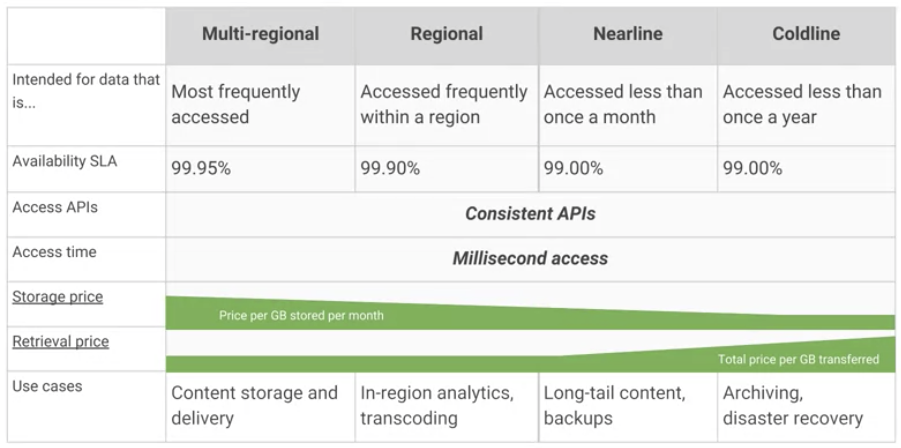

# Google Cloud Fundamentals: Core Infrastructure

## Introducing Google Cloud Platform
* 4 kinds of services: Compute, Storage, Big Data, Machine Learning
* This course will focus on compute, storage, and networking
* GCP locations are split into:
    - **Zone** (e.g., europe-west2-a)
    - **Region**: collections of zones with fast interconnections (e.g., europe-west2)
    - **Multi-Region**
* As of today (2021/08/18), total of 27 regions and 82 zones
    - View [cloud.google.com](https://cloud.google.com/) for more details
* GCP uses open interfaces to avoid vendor lock-in
    - e.g., Cloud Bigtable (Apache HBase API), Cloud Dataproc (Hadoop as managed service)
* Four ways to manage GCP spend:
    - **Budgets & Alerts** (fixed limits, or metric like % of prev month's spending)
    - **Billing export**
    - **Reports** (visual monitoring)
    - **Quotas** (rate quotas, allocation quotas)

## Getting Started with Google Cloud Platform

### Module Introduction

* **Projects**: main way to group to related resources, usually around related business
* Interfacing with GCP:
    - **Cloud Platform Console**
    - Cloud SDK and **Cloud Shell** (command-line launched in web browser from Console)
    - REST-based API: for custom applications
    - **Cloud Console Mobile App** (can build dashboards)
* Responsibility of user decreases from On-premises to IaaS to PaaS to Managed Services.

### The Google Cloud Platform resource hierarchy

* Resources are in Objects, and Projects are (optionally) organized into **Folders**, which are in Folders, in **Organization** nodes
* Projects are managed and billed separately
* Projects have IDs (globally unique, assigned by you), names, number (globally unique, assigned by GCP)
* Children resources transitively inherit IAM policies from parents
* Special roles for Organization nodes:
    - Organization Admin
    - Project Creator

### Identity and Access Management (IAM)

* IAM policy says "Who" "can do what" "on which resource":
    - Who: Google account, service account, Google group, Cloud Identity or G Suite domain
* Three types of role in IAM
    - **Primitive**: often too broad, especially when sensitive data involved. impact all resources in a project. Includes predefined roles:
        - **Owner**
        - **Editor**
        - **Viewer**
        - **Billing Administrator**
    - **Predefined**: offer more fine-grained controls on particular GCP service
    - **Custom**: enable you to define precise set of permissions.
        - Can only be used at Project or Organizational levels; not Folders.
* **Service Accounts**: provide identities used to control server-to-server interactions
* Policies are a union of those applied on resource itself and those inherited from higher levels in the hierarchy

### Interacting with Google Cloud Platform

* Many APIs are disabled by default
* **APIs Explorer**: APIs available, with supported versions, and built-in documentation
* Two kinds of libraries:
    - Cloud Client Libraries: recommended, community-owned, idiomatic
    - Google API Client Libraries: generated, open source

### Cloud Marketplace (formerly Cloud Launcher)

* **Cloud Marketplace** is a solution marketplace; some offered by Google, some by third-party vendors

### Demonstration, lab activity, and quiz

* **QWIKLABS**

## Virtual Machines in the Cloud

### Module Introduction

* **Compute Engine**: GCP IaaS that allows you to run virtual machines on Google's global infrastructure

### Virtual Private Cloud (VPC) Network

* Can either:
    - Create your own private VPC
    - Use default VPC
* Google Cloud VPCs are global; subnets are regional

### Compute Engine

* Can create instances of Compute Engine using Google Cloud Console or the **gcloud** command-line tool
* Pick predefined types (which combine memory and CPU requirements), or make custom VM
* GPUs available
* Two types of permanent disk: standard or SSD
* Use can use local SSD for high performance, ephemeral storage (ensure you use permanent disk for data you need to retain)
* Define a startup script, and other metadata
* Disk snapshots supported
* **Preemptible VMs**: like AWS EC2 spot instances, save money by allowing Google to terminate your instance if resources needed elsewhere
* Can scale up or out
* **Autoscaling**: automatically adding or removing Google Compute Engine resources based on load

### Important VPC capabilities

* **Routing Tables**: forwarding traffic from one Compute Engine instance to another within the same VPC network
* VPCs contain **firewalls** for restricting access to Compute Engine instances, both for incoming and outgoing traffic
    - Can define tags for resources that apply firewall rules; e.g., "web_server" tag to enable traffic over HTTPs port
* **Shared VPCs**: enable you to share VPC across multiple projects
* **VPC Peering**: enable you to interconnect networks across VPCs and projects
* **Cloud Load Balancing**: a global service that connects user to application using the closest point-of-presence
    - Key technology when scaling out
    - No pre-warming required
* Different load balancing options:
    - Global HTTPS
    - Global SSL Proxy
    - Global TCP Proxy
    - Regional: load balancing any traffic over any ports
    - Regional Internal: load balancing of traffic within a VPC
* **Cloud DNS**: GCP's managed DNS service, supporting CLI, Console, or API
* **Cloud CDN**: Google's globally distributed edge caches
* Google supports many interconnect options, including VPN (over internet), direct peering (private connection w/o SLA), carrier peering, dedicated interconnect (private connections w/ SLA)

### Demonstration, lab activity, and quiz

```
# display a list of all the zones in specific region
gcloud compute zones list | grep us-central1

# set default zone
gcloud config set compute/zone us-central1-b

# create compute instance
gcloud compute instances create "my-vm-2" \
--machine-type "n1-standard-1" \
--image-project "debian-cloud" \
--image-family "debian-10" \
--subnet "default"

# connect to another VM in another region
ssh my-vm-1.us-central1-a

# setup a webserver w/ static page
sudo apt-get install nginx-light -y
sudo vim /var/www/html/index.nginx-debian.html
```

## Storage in the Cloud

### Module Introduction
* Core storage options: Cloud Storage, Cloud SQL, Cloud Spanner, Cloud Data Store, and Google Big Table

### Cloud Storage
* **Cloud Storage**: Google's managed object store.
    - It's not a file system
    - Consists of buckets, where you store immutable objects; any changes are versioned
    - Always encrypted on disks and in transit via HTTPS
    - Uses IAM, but you can use **Access Control Lists** (**ACLs**) for finer-grained controls
    - ACLs contain scope (who can perform actions) and the permission (which action can be performed)
    - Lifecycle Management Policies; e.g., keep only 3 most recent versions of any object
* Storage classes:
    - Multi-regional: high performance, geo-redundant, price primarily storage-related
    - Regional: high performance, price primarily storage-related
    - Nearline: backup/archival, access less than once a month, price combo of storage- and retrieval- related
    - Coldline: backup/archival, access less than once a year, price primarily retrieval-related
* Importing data:
    - Online transfer (e.g., `gsutil`; drag & drop in GCP Console)
    - Storage Transfer Service (scheduled batch transfer from another cloud provider, another GCP region, or an HTTP endpoint)
    - Transfer Appliance (offline transfer via a leasable, rackable storage server)
* Interoperates with other GCP services:
    - BigQuery, Cloud SQL: import and export tables
    - App Engine: object storage, logs, Datastore backups
    - Compute Engine: startup scripts, images, object storage

### Cloud Bigtable

* **Cloud Bigtable**: Google's managed NoSQL, wide-column database for terabyte applications
    - High throughput for read and write, low latency
    - analytical and operational workloads
    - up to 99.999% availability
    - Same open source API as HBase, providing portability
    - Scales horizontally without downtime
    - Single row transactions
    - Actually used by Google for search, Maps, Google Analytics, and Gmail

### Cloud SQL and Cloud Spanner

* **Cloud SQL**: Managed RDBMS, including MySQL and PostgresQL
    - read, failover, and external replicas
    - on demand or scheduled backups
    - encrypted on demand
* **Cloud Spanner**: horizontally scalable managed RDMS with petabytes capacity
    - still provides transactional consistency

### Cloud Datastore

* **Cloud Datastore**: horizontally scalable NoSQL database
    - main use case: store structured data from App Engine apps
    - offers transactions across multiple rows
    - SQL-like interface

```
// Sample query. Source: https://cloud.google.com/datastore
var companies = query.filter('name =', 'Google').filter('size <', 400);
```

### Comparing Storage Options


* **Cloud BigQuery**: managed relational OLAP database

### Demonstration, lab activity, and quiz

Startup script:
```
apt-get update
apt-get install apache2 php php-mysql -y
service apache2 restart
```

```
$ export LOCATION=US
$ gsutil mb -l $LOCATION gs://$DEVSHELL_PROJECT_ID
Creating gs://qwiklabs-gcp-04-fe005f94794c/
$ gsutil cp gs://cloud-training/gcpfci/my-excellent-blog.png my-excellent-blog.png
$ gsutil cp my-excellent-blog.png gs://$DEVSHELL_PROJECT_ID/my-excellent-blog.png
```

## Containers in the Cloud

### Containers, Kubernetes, and Kubernetes Engine

```
from flask import Flask
app = Flask(__name__)

@app.route("/")
def hello():
  return "Hello, World!\n"

@app.route("/version")
def hello():
  return "Helloworld 1.0\n"

if __name__ == "__main__":
  app.run(host = "0.0.0.0")
```

```
FROM ubuntu:18.10
RUN apt-get update -y && \
    apt-get install -y python3-pip python3-dev
COPY requirements.txt /app/requirements.txt
WORKDIR /app
RUN pip3 install -r requirements.txt
COPY . /app
ENTRYPOINT ["python3", "app.py"]
```

```
$> docker build -t py-server .
$> docker run -d py-server
```

* **Google Kubernetes Engine** (**GKE**): Google's managed Kubernetes service

```
$> gcloud container clusters create k1
```

* **Pod**: smallest deployable unit (1+ containers) in Kubernetes
* **Deployment**: group of replicas of a given Pod in Kubernetes
* **Service**: Kubernetes abstraction for running a group of pods as a network service with a stable endpoint
* imperative vs declarative commands
* **RollingUpdate**: type of strategy for Kubernetes Deployment that performs a rolling deployment, including `maxSurge`, `maxUnavailable`

```
$> # imperative
$> kubectl run nginx --image=nginx:1.15.7
$> kubectl expose deployments nginx --port=80 --type=LoadBalancer
$> kubectl scale nginx --replicas=3
$> kubectl autoscale nginx --min=10 --max=15 --cpu=80
$>
$> # declarative
$> kubectl apply -f nginx-deployment.yaml
$>
$> # misc
$> kubectl get pods
$> kubectl get replicasets
$> kubectl get services
$> kubectl get pods -l "app=nginx" -o yaml   # outputs declarative config
```

* **Anthos**: Google's solution for hybrid and multi-cloud systems
    - Kubernetes and GKE create the foundation
    - **GKE On-Prem**: As part of Anthos, this is Google's on-prem turn-key production-grade Kubernetes
    - Both on-prem and GCP have access to GCP Marketplace
    - **Cloud Interconnect**: How on-prem and GCP applications communicate in Anthos
    - **Stackdriver**: provides managed logging, metrics gathering, monitoring, dashboarding, and alerting solution for on-prem and GCP applications
    - **Policy Repository**: Anthos' single source of truth, which is implemented as a Git repository either on prem or in GCP

### Lab: Demonstration, activity, and quiz

```
# create cluster
export MY_ZONE=us-central1-a
gcloud container clusters create webfrontend --zone $MY_ZONE --num-nodes 2
kubectl version   # kubectl automatically authenticated in above command

# start app
kubectl create deploy nginx --image=nginx:1.17.10
kubectl get pods
kubectl expose deployment nginx --port 80 --type LoadBalancer
kubectl get services

# scale app
kubectl scale deployment nginx --replicas 3
kubectl get pods
kubectl get services
```

## Applications in the Cloud

### Module introduction; introduction to App Engine

* **App Engine**: PaaS for building scalable applications
    - Scales to resources; only pay for what you use, making it ideal for highly variable workloads

### App Engine Standard Environment

* **App Engine Standard Environment**: simpler for of two App Engine environments
    - Free daily usage; some applications may be able to run free
* Runtimes include
* **App Engine SDK** Java, Python, PHP, Go; if want another language, use flexible environment
    - develop & test locally, then deploy using SDK
    - Services include (not limited to):
        - a NoSQL data store to make data persistent
        - caching of that data using Memcache
        - searching
        - logging
        - ability to launch actions not triggered by direct user requests, like task queues and a task scheduler
* Sandbox constraints:
    - No writing to local files
    - All requests time out at 60s
    - Limits on third-party software

### App Engine Flexible Environment

* **App Engine Flexible Environment**: allows you to specify Docker container, and App Engine will run application in Compute Engine




### Cloud Endpoints and Apigee Edge

* **Cloud Endpoints**: distributed API management for creating and managing API via Console, including generating client libraries and OAuth support

* **Apigee Edge**: platform for making API available to partners with analytics, monetization, and developer portal

### Demonstration, lab activity, and quiz


```
gcloud auth list  # list active project
gcloud config list project  # list project id

# initialize App Engine app
gcloud app create --project=$DEVSHELL_PROJECT_ID
git clone https://github.com/GoogleCloudPlatform/python-docs-samples
cd python-docs-samples/appengine/standard_python3/hello_world

# run app locally
sudo apt-get update
sudo apt-get install virtualenv
virtualenv -p python3 venv
source venv/bin/activate
pip install  -r requirements.txt
python main.py

# deploy to App Engine
cd ~/python-docs-samples/appengine/standard_python3/hello_world
gcloud app deploy
gcloud app browse  # launch app in http://YOUR_PROJECT_ID.appspot.com
```

## Developing, Deploying and Monitoring in the Cloud

### Development in the Cloud

* **Cloud Source Repositories**: fully featured git repositories hosting on GCP, enable IAM-managed access

* **Cloud Functions**: create single-purpose functions that respond to events without a server or runtime
    - Write in JavaScript/Node.JS
    - Billed in 100ms intervals
    - trigger on events in Cloud Storage, Cloud Pub/Sub, or in HTTP call

### Deployment: Infrastructure as code

* Setting up manually is an imperative approach
* **Deployment Manager**: declarative, repeatable deployments of GCP resources
    - Create yaml or Python template

### Monitoring: Proactive instrumentation

* **Stackdriver**: GCP's tool for monitoring, logging, and diagnostics
    - Monitoring: uptime/health checks, alerts
    - Logging: log search, filter, and export; log-based alerts and dashboards
    - Error Reporting: notifications, dashboards
    - Tracer: latency reporting and sampling
    - Debugger: view application state at given code location, without having to add tracers

### Demonstration, lab activity, and quiz

```
export MY_ZONE=us-central1-a

# deploying using Deployment Manager
gsutil cp gs://cloud-training/gcpfcoreinfra/mydeploy.yaml mydeploy.yaml
sed -i -e "s/PROJECT_ID/$DEVSHELL_PROJECT_ID/" mydeploy.yaml
sed -i -e "s/ZONE/$MY_ZONE/" mydeploy.yaml
cat mydeploy.yaml
gcloud deployment-manager deployments create my-first-depl --config mydeploy.yaml

# update using Deployment Manager
... # edit mydeploy.yaml
gcloud deployment-manager deployments update my-first-depl --config mydeploy.yaml

# creating CPU load
dd if=/dev/urandom | gzip -9 >> /dev/null &
```

## Big Data and Machine Learning in the Cloud

### Module introduction

* One day, every company will be a data company; data will be a competitive advantage

### Google Cloud Big Data Platform

* **Cloud Dataproc**: GCP managed Hadoop, based on map-reduce model
    - Clusters generally provisioned in 90s or less
    - 1s wall-clock billing, minimum of 1hrs
    - Can also use preemptable compute instances (around 80% cheaper at time of recording)
* **Cloud Dataflow**: managed data pipelines using Compute Engine instances, for purposes like ETL, analytics, and orchestration
    - **Dataflow pipelines** flow data from a source (e.g., BigQuery) through transforms to a sink (e.g., Cloud Storage)
    - Integrates with services like Cloud Storage, Cloud Pub/Sub, BigQuery and Bigtable
* **BigQuery**: GCP's fully managed petabyte-scale data warehouse using SQL
    - read and write data in BigQuery via Cloud Dataflow, Hadoop, and Spark
    - free monthly quotas
    - 99.9% SLA
    - Person running query pays for query, not the warehouse owner
* **Cloud Pub/Sub**: scalable, reliable topic-based messaging
    - guaranteed at least once delivery
    - support push and pull
* **Cloud Datalab**: managed interactive Python environment via Jupyter notebooks
    - integrated with BigQuery, Compute Engine, Cloud Storage
    - Visualize with Google Charts or matplotlib

### Google Cloud Machine Learning Platform

* **Cloud Machine Learning Platform**: managed machine learning platform including pretrained and models and support for custom models
    - Supports CPU, GPU, TPU
* **Cloud Vision API**: analyze images with RESTful API, classifying into thousands of categories, sentiment analysis, text extraction, etc.
* **Cloud Natural Language API**: derive insights from unstructured text using Google machine learning
    - Supports multiple languages
    - Support sentiment analysis, extracting info about items mentioned in documents, and reveals structure and meaning of text
* **Cloud Translation API**: translates arbitrary strings between thousands of language pairs
    - Automatically detect language
* **Cloud Video Intelligence API**: GCP service that annotates contents of videos, detects scene changes, and flags inappropriate context

### Demonstration, lab activity, and quiz

```
$ bq query "select string_field_10 as request, count(*) as requestcount from logdata.accesslog group by request order by requestcount desc"
```

## Summary and Review

### Course review







### Next Steps

1. If you're an architect, continue with the Coursera specialization "Architecting with Google Cloud Platform"
1. If you're an app developer, continue with the Coursera specialization "Developing applications with Google Cloud Platform"
