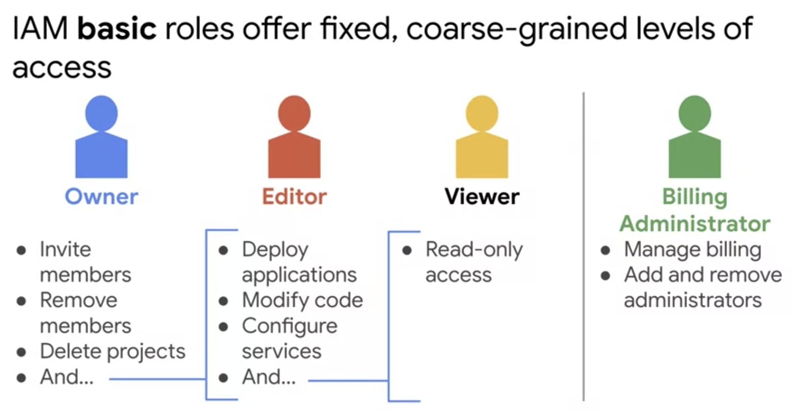

# Essential Google Cloud Infrastructure: Core Services

## Week 1

### Welcome to Essential Cloud Infrastructure: Core Services

#### Course Introduction

* "Elastic Cloud Infrastructure: Scaling and Automation" is the next and last course of this architecture series. Includes:
    1. Interconnecting Networks
    2. Load Balancing and Autoscaling
    3. Infrastructure Automation (Deployment Manager and Terraform)
    4. Managed Services

#### Welcome to Essential Cloud Infrastructure: Core Services

* This course:
    1. Cloud IAM
    2. Data Storage Services
    3. Resource Management
    4. Resource Monitoring

#### How to download course resources

### Overview

#### Module Overview

### Cloud IAM

#### Cloud IAM

* **Identity and Access Management** (**IAM**): Way to say 1)who 2) can do what 3) on which resource
* Cloud IAM resource hierarchy
    - Organization (e.g., your company)
    - Folders (E.g., your department)
    - Projects
    - Resources
* In Cloud IAM resource hierarchy, resources inherit policies from parent transitively, and child policies cannot restrict access granted by the parent

#### Organization

* Roles:
    - **Organization Admin**: define IAM policies, determine structure of resource hierarchy, delegate responsibilities (e.g., billing) through IAM roles
    - **Project Creator**
    - **Workspace or Cloud Identity Super User**: assigns organization admin, point of contact for recovery issues, control lifecycle of organization and account
* Organization automatically created whenever a Google Workspace or a Cloud Identity account created a Google Cloud Project
* Folders create isolation boundaries and allow delegation of administration rights

#### Roles

* Three types of Cloud IAM roles:
    1. **Basic**: apply across all services within a project
    2. **Predefined**: apply to specific GCP service within a project
    3. **Custom**:

#### Demo: Custom roles

#### Members

* **Google Workspace**: the new name for "G Suite"
* You cannot use IAM to create or manage your users or groups
* 5 types of members:
    1. **Google accounts**
    2. **Service accounts**: belongs to application instead of end user.
    3. **Google Groups**
    4. **Cloud Identity Domains**: similar to Google Workspace Domains, but don't pay for nor receive the suite of collaboration products (Calendar, Drive, Docs, Gmail).
        - Includes free and premium versions
        - Premium includes mobile application for management
    5. **Google Workspace Domains**: for domain; e.g., example.com
* **Google Cloud Directory Sync**: scheduled, one-way synchronization between Microsoft Active Directory (or LDAP) and users/groups within Cloud Identity domain
* Cloud Identity also provides SSO
    - can use SAML SSO or third-party solution (e.g., ADFS, Ping, Okta)

#### Service Accounts

* Identified by email address. E.g., `1234567890-compute@project.gserviceaccount.com`
* Three types of service accounts:
    1. User-created (custom)
    2. Built-in: automatically created within project for Compute and App Engine, automatically has editor access
        - `<project number>-compute@developer.gserviceaccount.com`
        - automatically used by all instances created using GCP or Console
    3. Google APIs service account: all projects come with one, runs internal Google processes on your behalf and automatically has admin access
* Authorization: process of identifying which permissions an authenticated resource has on specified resources
    - **Access Scopes**: legacy system for specifying permissions for VM
        - e.g., receive access tokens for Cloud Storage with `read_only`, `read_right`
        - use Cloud IAM instead
* Roles for service accounts can be assigned to users or groups (so these users can act as the service account)
* Service accounts authenticate using keys:
    1. GCP-managed: cannot be downloaded, automatically rotated (at least every 2 weeks)
    2. User-managed: create, manage, rotate yourself

#### Cloud IAM best practices

1. Leverage and understand the resource hierarchy
2. Grant roles to Google groups instead of individuals
3. Be careful with service accounts
    - Be careful when assigning `serviceAccountUser` role
    - Establish a clear naming convention
4. Use **Cloud Identity-Aware Proxy** (**IAP**): central authorization layer for applications accessed by HTTPS that provides identity-based access controls
    - enforces Cloud IAM access policies after authentication
    - doesn't require a VPN

#### Lab Intro: Cloud IAM

* Note: IAM Console refreshes faster than systems, so expect short delay after changing accesses

#### Lab: Cloud IAM

### Review

#### Quiz: Cloud IAM

#### Module Review

## Week 2
