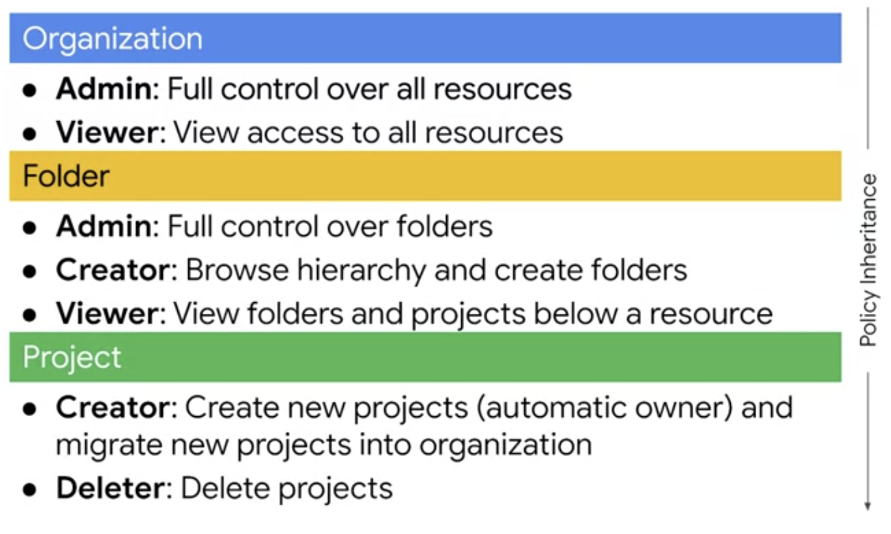
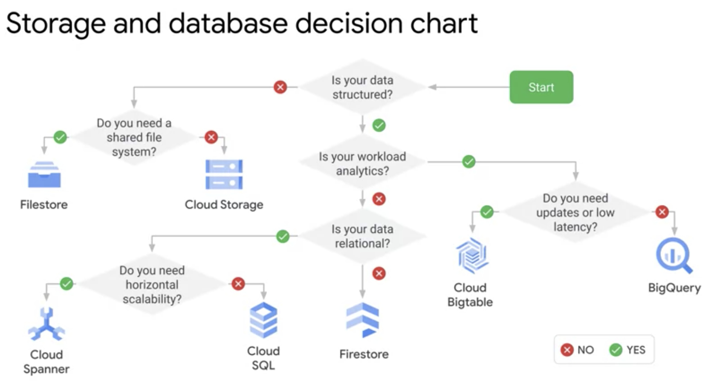
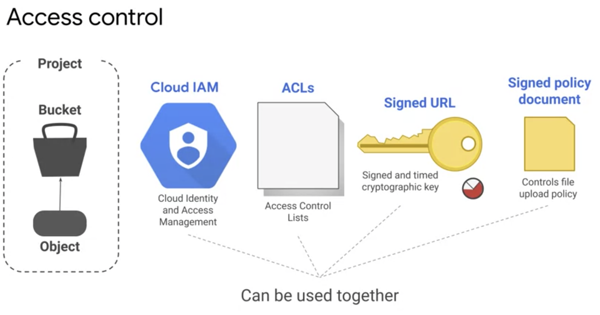
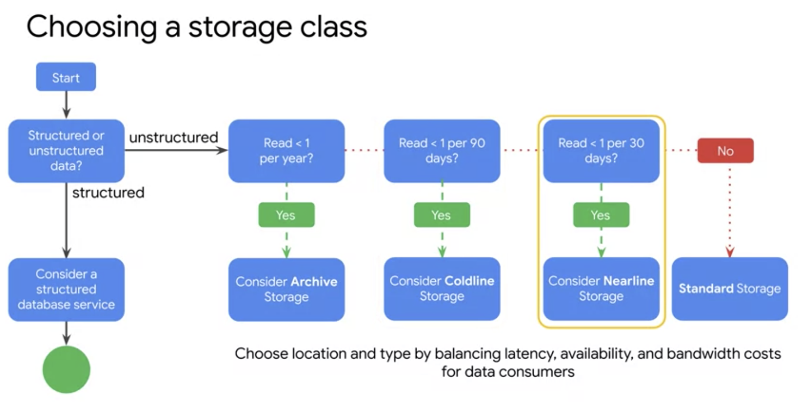
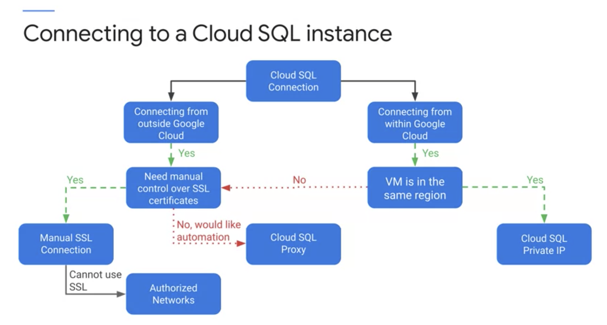
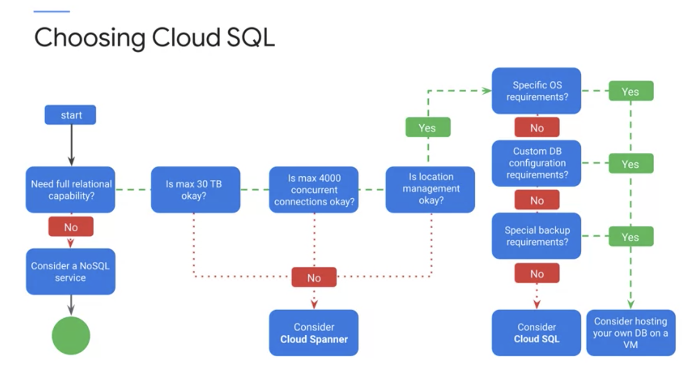
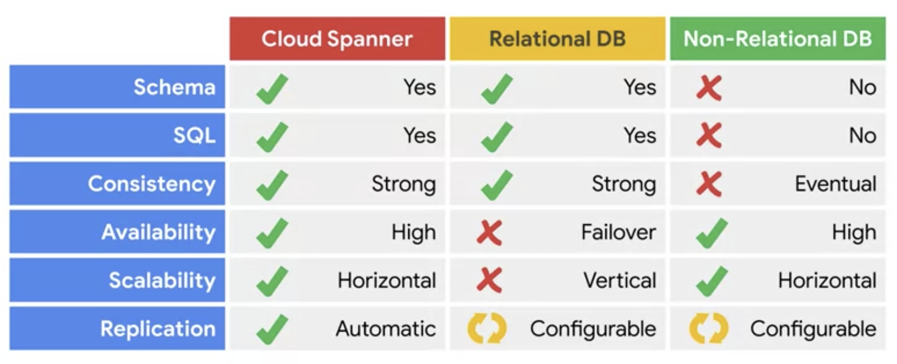
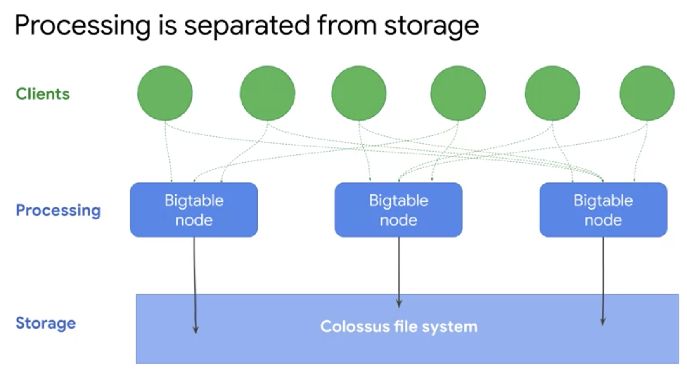

# Essential Google Cloud Infrastructure: Core Services

## Week 1

### Welcome to Essential Cloud Infrastructure: Core Services

#### Course Introduction

* "Elastic Cloud Infrastructure: Scaling and Automation" is the next and last course of this architecture series. Includes:
    1. Interconnecting Networks
    2. Load Balancing and Autoscaling
    3. Infrastructure Automation (Deployment Manager and Terraform)
    4. Managed Services

#### Welcome to Essential Cloud Infrastructure: Core Services

* This course:
    1. Cloud IAM
    2. Data Storage Services
    3. Resource Management
    4. Resource Monitoring

#### How to download course resources

### Overview

#### Module Overview

### Cloud IAM

#### Cloud IAM

* **Identity and Access Management** (**IAM**): Way to say 1)who 2) can do what 3) on which resource
* Cloud IAM resource hierarchy
    - Organization (e.g., your company)
    - Folders (E.g., your department)
    - Projects
    - Resources
* In Cloud IAM resource hierarchy, resources inherit policies from parent transitively, and child policies cannot restrict access granted by the parent

#### Organization

* Roles:
    - **Organization Admin**: define IAM policies, determine structure of resource hierarchy, delegate responsibilities (e.g., billing) through IAM roles
    - **Project Creator**
    - **Workspace or Cloud Identity Super User**: assigns organization admin, point of contact for recovery issues, control lifecycle of organization and account
* Organization automatically created whenever a Google Workspace or a Cloud Identity account created a Google Cloud Project
* Folders create isolation boundaries and allow delegation of administration rights



#### Roles

* Three types of Cloud IAM roles:
    1. **Basic**: apply across all services within a project
    2. **Predefined**: apply to specific GCP service within a project
    3. **Custom**:


#### Demo: Custom roles

#### Members

* **Google Workspace**: the new name for "G Suite"
* You cannot use IAM to create or manage your users or groups
* 5 types of members:
    1. **Google accounts**
    2. **Service accounts**: belongs to application instead of end user.
    3. **Google Groups**
    4. **Cloud Identity Domains**: similar to Google Workspace Domains, but don't pay for nor receive the suite of collaboration products (Calendar, Drive, Docs, Gmail).
        - Includes free and premium versions
        - Premium includes mobile application for management
    5. **Google Workspace Domains**: for domain; e.g., example.com
* **Google Cloud Directory Sync**: scheduled, one-way synchronization between Microsoft Active Directory (or LDAP) and users/groups within Cloud Identity domain
* Cloud Identity also provides SSO
    - can use SAML SSO or third-party solution (e.g., ADFS, Ping, Okta)

#### Service Accounts

* Identified by email address. E.g., `1234567890-compute@project.gserviceaccount.com`
* Three types of service accounts:
    1. User-created (custom)
    2. Built-in: automatically created within project for Compute and App Engine, automatically has editor access
        - `<project number>-compute@developer.gserviceaccount.com`
        - automatically used by all instances created using GCP or Console
    3. Google APIs service account: all projects come with one, runs internal Google processes on your behalf and automatically has admin access
* Authorization: process of identifying which permissions an authenticated resource has on specified resources
    - **Access Scopes**: legacy system for specifying permissions for VM
        - e.g., receive access tokens for Cloud Storage with `read_only`, `read_right`
        - use Cloud IAM instead
* Roles for service accounts can be assigned to users or groups (so these users can act as the service account)
* Service accounts authenticate using keys:
    1. GCP-managed: cannot be downloaded, automatically rotated (at least every 2 weeks)
    2. User-managed: create, manage, rotate yourself

#### Cloud IAM best practices

1. Leverage and understand the resource hierarchy
2. Grant roles to Google groups instead of individuals
3. Be careful with service accounts
    - Be careful when assigning `serviceAccountUser` role
    - Establish a clear naming convention
4. Use **Cloud Identity-Aware Proxy** (**IAP**): central authorization layer for applications accessed by HTTPS that provides identity-based access controls
    - enforces Cloud IAM access policies after authentication
    - doesn't require a VPN

#### Lab Intro: Cloud IAM

* Note: IAM Console refreshes faster than systems, so expect short delay after changing accesses

#### Lab: Cloud IAM

### Review

#### Quiz: Cloud IAM

#### Module Review

### Overview

#### Module Overview




### Cloud Storage and Filestore

#### Cloud Storage

* Cloud Storage is Google's object storage service
* Scalable to exabytes




* **Access Control Lists** (**ACLs**): list of up to 100 scope (users) and permissions
    - examples: collaborator@gmail.com, `allUsers`, `allAuthenticatedUsers`
* **Signed URLs**: "Valley ticket" limited-time access via cryptographically signed URL to buckets and objects
    - `gsutil signurl -d 10m path/to/privatekey.p12 gs://bucket/object`

#### Cloud Storage Features

* **CSEK**: Cloud-supplied encryption keys (acronym)
* Object lifecycle management
* Object versioning
* Directory synchronization: synchronize a VM directory with a bucket
* Object change notification:
    - notify application when an object is updated or added to a bucket via web hook
    - however, recommend Pub/Sub notifications for Cloud Storage
* Data import
* Strong consistency

#### Choosing a storage class



#### Filestore

* **Filestore**: fully managed file storage service using network attached storage for Compute Engine or GKE instances
    - Scales to 100s of TBs

#### Lab Intro: Cloud Storage

#### Lab: Cloud Storage

* Note GCP supports boto config file (`~/.boto`), which is also used by boto (Amazon SDK for Python)

Sample lifecycle policy:
```
{
  "rule":
  [
    {
      "action": {"type": "Delete"},
      "condition": {"age": 31}
    }
  ]
}
```

```
export BUCKET_NAME_1=[buck-name]
gsutil cp setup.html gs://$BUCKET_NAME_1/

# - - - - - - - - - - - - - - - - - - - - - - - -
# ACL
# - - - - - - - - - - - - - - - - - - - - - - - -
gsutil acl get gs://$BUCKET_NAME_1/setup.html               # echos ACL to stdout
gsutil acl set private gs://$BUCKET_NAME_1/setup.html       # make file private
gsutil acl ch -u AllUsers:R gs://$BUCKET_NAME_1/setup.html  # but then add public read

# - - - - - - - - - - - - - - - - - - - - - - - -
# Customer-supplied encryption keys (CSEK)
# - - - - - - - - - - - - - - - - - - - - - - - -

#   To generate a key:
#   https://cloud.google.com/storage/docs/encryption/using-customer-supplied-keys#storage-generate-encryption-key-python

# only do this if there's not ~/.boto file already
gsutil config -n        # generate ~/.boto
vim .boto               # uncomment "encryption_key=", and add the key
gsutil cp setup2.html gs://$BUCKET_NAME_1/      # note that it's customer encrypted

# after rotating a key, can rewrite for files:
gsutil rewrite -k gs://$BUCKET_NAME_1/setup2.html

# - - - - - - - - - - - - - - - - - - - - - - - -
# Lifecycle management
# - - - - - - - - - - - - - - - - - - - - - - - -

gsutil lifecycle get gs://$BUCKET_NAME_1    # view lifecycle mgmt policy
gsutil lifecycle set life.json gs://$BUCKET_NAME_1

# - - - - - - - - - - - - - - - - - - - - - - - -
# Versioning
# - - - - - - - - - - - - - - - - - - - - - - - -
gsutil versioning get gs://$BUCKET_NAME_1
gsutil versioning set on gs://$BUCKET_NAME_1
gsutil cp -v setup.html gs://$BUCKET_NAME_1
gsutil ls -a gs://$BUCKET_NAME_1/setup.html     # list all versions


# - - - - - - - - - - - - - - - - - - - - - - - -
# Synchronizing directory
# - - - - - - - - - - - - - - - - - - - - - - - -
gsutil rsync -r ./firstlevel gs://$BUCKET_NAME_1/firstlevel
gsutil ls -r gs://$BUCKET_NAME_1/firstlevel

# - - - - - - - - - - - - - - - - - - - - - - - -
# Authorize the VM for cross-account
# - - - - - - - - - - - - - - - - - - - - - - - -
gcloud auth activate-service-account --key-file credentials.json  # adding credentials to a VM
```

#### Lab Review: Cloud Storage

### Cloud SQL

#### Cloud SQL

* **Cloud SQL**: fully managed MySQL, PostgreSQL, or Microsoft SQL Server service
* Clients:
    - `gcloud sql`
    - App Engine, Google Workspace scripts
    - Applications (e.g., SQL Workbench, Toad) & tools
* Scale up, or scale out with read replicas
* Support high availability
    - Standby receives synchronous replication from primary as part of transaction, fail over





#### Lab: Implementing Cloud SQL

In this lab, you configure a Cloud SQL server and learn how to connect an application to it via a proxy over an external connection. You also configure a connection over a Private IP link that offers performance and security benefits. The app we chose to demonstrate in this lab is Wordpress, but the information and best practices are applicable to any application that needs SQL Server.

By the end of this lab, you will have 2 working instances of the Wordpress frontend connected over 2 different connection types to their SQL instance backend, as shown in this diagram:


### Other database services

#### Cloud Spanner

* SQL
* Scales to petabytes
* Provides transactions, strong consistency, and high availability
* 99.99% regional uptime, 99.999% multi-regional uptime



#### Cloud Firestore

* **Cloud Firestore**: as the next generation of Cloud Datastore, this is a fully managed NoSQL document database
    - ACID transactions
    - Multi-region replication
    - Strong consistency
* Native mode (new features, like client libraries and real-time updates) vs Datastore mode (backwards-compatible)

#### Cloud Bigtable

* Petabyte-scale
* High read/write throughput at low (sub-10ms) latency
* Powers core internal Google services, e.g., Maps, Gmail, Search
* Works for operational and analytical applications
* Supports HBase API
* Sparse tables; if no value, no space taken up
* Smallest cluster is 3 nodes, which can handle 33k operations/second



#### Cloud Memorystore

* **Cloud Memorystore**: Google's fully managed Redis service
    - instances up to 300GB
    - sub-millisecond latency

### Review

#### Quiz: Storage and Database Services

#### Module Review

## Week 2
