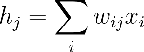

# Implementing Gradient Descent

## 1. Mean Squared Error Function

## 2. Gradient Descent

* **Sum of Squared Errors** (**SSE**): E = 1/2 ∑∑ [yⱼⁱ - ŷⱼⁱ]²

## 3. Gradient Descent: The Math

## 4. Gradient Descent: The Code

* Implementing single step of gradient descent:
    ```python
    import numpy as np

    def sigmoid(x):
        return 1/(1+np.exp(-x))

    def sigmoid_prime(x):
        return sigmoid(x) * (1 - sigmoid(x))

    learnrate = 0.5
    x = np.array([1, 2, 3, 4])
    y = np.array(0.5)

    # Initial weights
    w = np.array([0.5, -0.5, 0.3, 0.1])

    h = np.dot(x, w)
    nn_output = sigmoid(h)
    error = y - nn_output
    error_term = error * sigmoid_prime(h)

    # calculate change in weights
    del_w = learnrate * error_term * x

    print('Neural Network output:')
    print(nn_output)
    print('Amount of Error:')
    print(error)
    print('Change in Weights:')
    print(del_w)
    ```

## 5. Implementing Gradient Descent

* Gradient descent algorithm:
    1. Set the weight step to zero: Δwᵢ = 0
    2. For each record in the training data:
        1. Make a forward pass through the network, calculating the output ŷ = f(∑ wᵢxᵢ)
        2. Calculate the error term for the output unit, δ = (y - ŷ) * ƒ′(∑ wᵢxᵢ)
        3. Update the weight step Δwᵢ = Δwᵢ + δxᵢ
    4. Update the weights wᵢ = wᵢ + ηΔwᵢ/m, where η is the learning rate and m is the number of records
    5. Repeat for e epochs.

* Recall sigmoid σ(x) = 1/(1+e⁻ˣ) and σ′(x) = σ(x)(1 - σ(x))

* Need to initialize weights randomly to break symmetry
    - we'll initialize using normal distribution centered at 0
    - we'll scale at 1/√n, where n is the number of input units
    ```python
    weights = np.random.normal(scale=1/n_features**.5, size=n_features)
    ```

* Implementing a neural network _without_ a hidden layer:
    ```python
    import numpy as np
    from data_prep import features, targets, features_test, targets_test

    def sigmoid(x):
        return 1 / (1 + np.exp(-x))

    np.random.seed(42)

    n_records, n_features = features.shape
    last_loss = None

    # Initialize weights
    weights = np.random.normal(scale=1 / n_features**.5, size=n_features)

    # hyperparameters
    epochs = 1000
    learn_rate = 0.5

    for e in range(epochs):
        del_w = np.zeros(weights.shape)

        # for each record, x is the input, y is the target
        for x, y in zip(features.values, targets):
            output = sigmoid(np.dot(x, weights))
            error = y - output
            error_term = error * output * (1 - output)
            del_w += error_term * x

        weights += learn_rate * del_w / n_records

        # Printing out the mean square error on the training set
        if e % (epochs / 10) == 0:
            out = sigmoid(np.dot(features, weights))
            loss = np.mean((out - targets) ** 2)
            if last_loss and last_loss < loss:
                print("Train loss: ", loss, "  WARNING - Loss Increasing")
            else:
                print("Train loss: ", loss)
            last_loss = loss

    test_out = sigmoid(np.dot(features_test, weights))
    predictions = test_out > 0.5
    accuracy = np.mean(predictions == targets_test)
    print("Prediction accuracy: {:.3f}".format(accuracy))
    ```

## 6. Multilayer Perceptrons

* `wᵢⱼ`, where `ᵢ` denotes the input unit and `ⱼ` denotes the hidden unit
    
* Weights now need to be stored in a matrix instead of an array:
    
* Initializing weights using NumPy:
    ```python
    n_records, n_inputs = features.shape
    n_hidden = 2
    weights_input_to_hidden = np.random.normal(0, n_inputs**-0.5, size=(n_inputs, n_hidden))
    ```
* We use matrix multiplication (dot product) to find `hⱼ`:
    
    ```python
    hidden_inputs = np.dot(inputs, weights_input_to_hidden)
    ```
* By default, NumPy arrays are **row vectors** (1xn), but sometimes you want a **column vector** (nx1).
    - To transpose a one-dimensional array, use `arr[:, None]` or `np.array(features, ndmin=2).T`
    - To transpose a multi-dimensional array, use `arr.T`
* Implementing feedforward in a multilayer perceptron:
    ```python
    import numpy as np

    def sigmoid(x):
        return 1/(1+np.exp(-x))

    # Network size
    N_input = 4
    N_hidden = 3
    N_output = 2

    np.random.seed(42)

    # fake input data
    X = np.random.randn(4)

    # initialize weights
    weights_input_to_hidden = np.random.normal(0, scale=0.1, size=(N_input, N_hidden))
    weights_hidden_to_output = np.random.normal(0, scale=0.1, size=(N_hidden, N_output))

    hidden_layer_in = np.dot(X, weights_input_to_hidden)
    hidden_layer_out = sigmoid(hidden_layer_in)

    output_layer_in = np.dot(hidden_layer_out, weights_hidden_to_output)
    output_layer_out = sigmoid(output_layer_in)
    ```

## 7. Backpropagation

## 8. Implementing Backpropagationß

## 9. Further Reading
