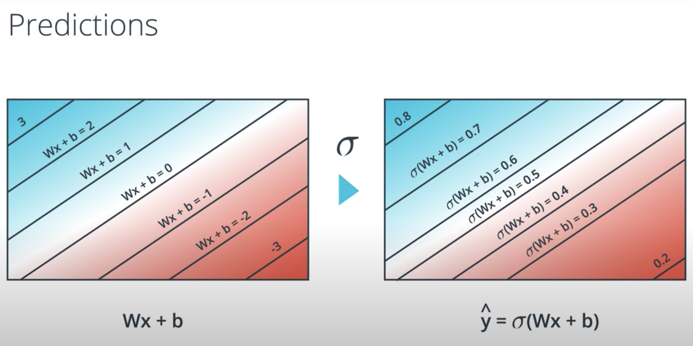

# Introduction to Neural Networks

## 1 - Instructor

## 2 - Introduction

* Deep learning use cases
1. AlphaGo and other game playing
1. Expert systems, sometimes outperforming exports (e.g., doctors)
1. Self-driving cars

## Lessons 3 - 7, 9 - 11
See: [Perceptron notes](../supervised-learning/perceptron)

## 8 - Why neural networks?

## 12 - Non-linear Regions

* Current perceptron algorithm only works for linearly separable problems

## 13 - Error functions

## 14 - Log-loss Error Function

* E.g., with gradient descent of a mountain, your error would be your height on the mountain

* If our error function is discrete, it can get stuck, as multiple options may have same error value

* Hence, we don't want our error function to be the number of misclassified points

* To apply gradient descent, function should be continuous and differentiable

## 15 - Discrete vs Continuous

* Activation function:
    - Should be continuous function (e.g., sigmoid) instead of discrete (e.g., step function)
    - This means that _every_ point has a probability of being correct

* **sigmoid function**: σ(x) = 1/(1+e⁻ˣ)

* Basically, our perceptron takes `W` and `b` (just like before), and generate a value that we feed into the sigmoid function:



* So our activation function for the second perceptron is the sigmoid function:


* Quiz: If the score is defined by 4x₁ + 5x₂ - 9 = score, then which of the following points has exactly a 50% probability of being blue or red?

```
[✓] (1,1)
[x] (2,4)
[x] (5,-5)
[✓] (-4,5)

We want to choose everything where 4x₁ + 5x₂ - 9 = 0, given σ(x=0) = 1/(1+e⁰) = 1/2.
```

# 16 - Softmax

* **Softmax function**: P(classᵢ) = e^Zᵢ / ∑ e^Zⱼ for all scores in Z. Functions as a multiclass sigmoid.

```python
import numpy as np
from math import exp

def softmax(Z):
    calc = lambda a: exp(a) / sum([exp(b) for b in Z])
    return [calc(Z[idx]) for idx in range(len(Z))]
```

# 17 - One-Hot Encoding

# 18 - Maximum Likelihood

* **maximum likelihood**: select the model that gives existing labels the highest probability

* Calculate `P(All)` by multiplying the probabilities that that the predicted labels are true and multiplying them all together


To get these probabilities, use `y = σ(Wx + b)`. Note that if the probability is misclassified, the probability is 1 - P(correct).

* Our new goal: use maximum likelihood to maximize `P(All)`

# 19 - Maximizing Probabilities

* However, products of lots of probabilities are bad, because 1) they will result in very small probability, and 2) changing one number could have big impact on overall probability

* We need a function that turns products into sums. Hint: recall that `log(ab) = log(a) + log(b)`

# 20 - Cross-Entropy 1

* So instead of 0.6 * 0.2 * 0.1 * 0.7 = 0.0084, we use:
    ```
    -ln(0.6) + -ln(0.2) + -ln(0.1) + -ln(0.7)
    = 0.51 + 1.61 + 2.3 + 0.36 = 4.8 (high, so not great)
    ```

* **cross-entropy**: -∑∑ yᵢⱼ ln(pᵢⱼ). how likely are the events, based on specified probabilities? low values are better than high values.


* New goal: instead of maximizing probability, minimize cross-entropy

# 21 - Cross-Entropy 2

* For two classes, the formula is:
    ```
    Cross-Entropy = -∑[yᵢln(pᵢ) + (1-yᵢ)ln(1-pᵢ)].
    ```
    Where `yᵢ` is `{0,1}` classification. (e.g., receive a gift or not.)

* In Python:
    ```python
    import numpy as np
    import math

    # For two classes
    def cross_entropy(Y, P):
        assert len(Y) == len(P)
        entropy = 0
        for i in range(0, len(P)):
            entropy -= Y[i] * math.log(P[i]) + (1 - Y[i]) * math.log(1 - P[i])
        return entropy
    ```

# 22 - Multi-Class Cross-Entropy

* For multiple classes, the formula is:
    ```
    Cross-Entropy = -∑∑ yᵢⱼ ln(pᵢⱼ)
    ```
  Where `yᵢⱼ` is `{0,1}` classification. (e.g., is it a walrus?)


# 23 - Logistic Regression

# 24 - Gradient Descent

# 25 - Logistic Regression Algorithm

# 26 - Pre-Lab: Gradient Descent

# 27 - Notebook: Gradient Descent

# 28 - Perceptron vs Gradient Descent

# 29 - Continuous Perceptrons

# 30 - Non-linear Data

# 31 - Non-linear Models

# 32 - Neural Network Architecture

# 33 - Feedforward

# 34 - Backpropogation

# 35 - Pre-lab: Analyzing Student Data

# 36 - Notebook: Analyzing Student Data

# 37 - Outro
