# Introduction to Neural Networks

## 1 - Instructor

## 2 - Introduction

* Deep learning use cases
  1. AlphaGo and other game playing
  1. Expert systems, sometimes outperforming exports (e.g., doctors)
  1. Self-driving cars

## Lessons 3 - 7, 9 - 11
See: [Perceptron notes](../supervised-learning/perceptron)

## 8 - Why neural networks?

## 12 - Non-linear Regions

* Current perceptron algorithm only works for linearly separable problems

## 13 - Error functions

## 14 - Log-loss Error Function

* E.g., with gradient descent of a mountain, your error would be your height on the mountain

* If our error function is discrete, it can get stuck, as multiple options may have same error value

* Hence, we don't want our error function to be the number of misclassified points

* To apply gradient descent, function should be continuous and differentiable

## 15 - Discrete vs Continuous

* Activation function:
    - Should be continuous function (e.g., sigmoid) instead of discrete (e.g., step function)
    - This means that _every_ point has a probability of being correct

* **sigmoid function**: σ(x) = 1/(1+e⁻ˣ)

* Basically, our perceptron takes `W` and `b` (just like before), and generate a value that we feed into the sigmoid function:


* So our activation function for the second perceptron is the sigmoid function:


* Quiz: If the score is defined by 4x₁ + 5x₂ - 9 = score, then which of the following points has exactly a 50% probability of being blue or red?

```
[✓] (1,1)
[x] (2,4)
[x] (5,-5)
[✓] (-4,5)

We want to choose everything where 4x₁ + 5x₂ - 9 = 0, given σ(x=0) = 1/(1+e⁰) = 1/2.
```

# 16 - Softmax

* **Softmax function**: P(classᵢ) = e^Zᵢ / ∑ e^Zⱼ for all scores in Z. Functions as a multi-class sigmoid.

```python
import numpy as np
from math import exp

def softmax(Z):
    calc = lambda a: exp(a) / sum([exp(b) for b in Z])
    return [calc(Z[idx]) for idx in range(len(Z))]
```

# 17 - One-Hot Encoding

# 18 - Maximum Likelihood

* **maximum likelihood**: select the model that gives existing labels the highest probability

* Calculate `P(All)` by multiplying the probabilities that that the predicted labels are true and multiplying them all together

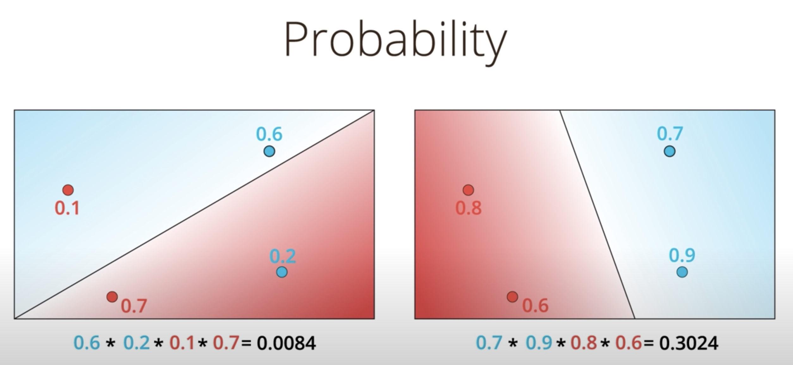

To get these probabilities, use `y = σ(Wx + b)`. Note that if the probability is misclassified, the probability is 1 - P(correct).

* Our new goal: use maximum likelihood to maximize `P(All)`

# 19 - Maximizing Probabilities

* However, products of lots of probabilities are bad, because 1) they will result in very small probability, and 2) changing one number could have big impact on overall probability

* We need a function that turns products into sums. Hint: recall that `log(ab) = log(a) + log(b)`

# 20 - Cross-Entropy 1

* So instead of 0.6 * 0.2 * 0.1 * 0.7 = 0.0084, we use:
    ```
    -ln(0.6) + -ln(0.2) + -ln(0.1) + -ln(0.7)
    = 0.51 + 1.61 + 2.3 + 0.36 = 4.8 (high, so not great)
    ```

* **cross-entropy**: -∑∑ yᵢⱼ ln(pᵢⱼ). how likely are the events, based on specified probabilities? low values are better than high values.

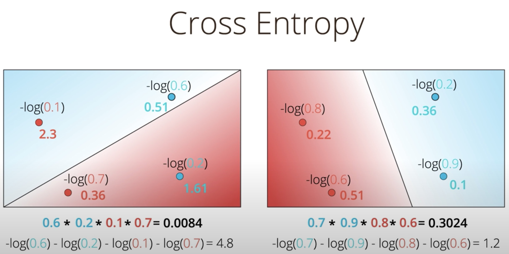

* New goal: instead of maximizing probability, minimize cross-entropy

# 21 - Cross-Entropy 2

* For two classes, the formula is:
    ```
    Cross-Entropy = -∑[yᵢln(pᵢ) + (1-yᵢ)ln(1-pᵢ)].
    ```
    Where `yᵢ` is `{0,1}` classification. (e.g., receive a gift or not.)

* In Python:
    ```python
    import numpy as np
    import math

    # For two classes
    def cross_entropy(Y, P):
        assert len(Y) == len(P)
        entropy = 0
        for i in range(0, len(P)):
            entropy -= Y[i] * math.log(P[i]) + (1 - Y[i]) * math.log(1 - P[i])
        return entropy
    ```

# 22 - Multi-Class Cross-Entropy

* For multiple classes, the formula is:
    ```
    Cross-Entropy = -∑∑ yᵢⱼ ln(pᵢⱼ)
    ```
  Where `yᵢⱼ` is `{0,1}` classification. (e.g., is it a walrus?)


# 23 - Logistic Regression

* The logistic regression is the building block for deep learning

* Note:
  ```
  ŷ = P(yᵢ) = σ(Wxᵢ + b)
  ```

* **binary logistic regression error function**:
  ```
  error = -1/m ∑ (1-yᵢ) ln(1-ŷ) + yᵢ ln(ŷ)
        = -1/m ∑ (1-yᵢ) ln(1-σ(Wxᵢ + b)) + yᵢ ln(σ(Wxᵢ + b))
  ```

* **multi-class logistic regression error function**:
  ```
  error = -1/m ∑∑ yᵢⱼ ln(ŷ)
        = -1/m ∑∑ yᵢⱼ ln(σ(Wxᵢ + b))
  ```

* Our goal is to minimize the error.

# 24 - Gradient Descent

* Gradient descent can be thought of a graph, where the error is one axis, and other axes are the weights
    - We'll take steps in directions that reduce our error, as determined by partial derivates, `∂E/∂w₁`, `∂E/∂w₂`, ...etc, `∂E/∂b`
    - The size of these steps will be determined by the learning rate, `α`

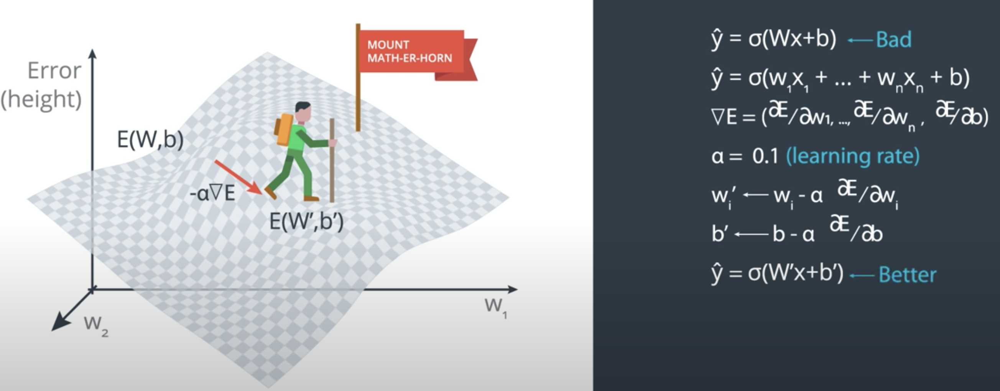

* Interestingly, the **gradient of the error function** is:
  ```
  ∇E = -(y - ŷ)x₁, ..., -(y-ŷ)xᵢ, -(y-ŷ)
     = -(y - ŷ)(x₁, ..., xᵢ, 1)
  ```

* **gradient descent step**:
  ```
  wᵢ′ <- wᵢ - α[-(y-ŷ)xᵢ]
      <- wᵢ + α(y-ŷ)xᵢ

  b′ <- b + α(y-ŷ)
  ```

# 25 - Logistic Regression Algorithm

* **gradient descent algorithm**:
  1. assign random weights w₁, ..., wᵢ, b
  2. for every point (x₁, ..., xᵢ):
       for i=1...n
           wᵢ′ <- wᵢ + α(y-ŷ)xᵢ
           b′ <- b + α(y-ŷ)
  3. repeat step 2 until error small, or fixed number of times

* The gradient descent algorithm is basically the perceptron algorithm!
  - The only difference is that gradient descent supports continuous values from 0 to 1, whereas perceptron algorithm supports discret values 0 or 1

# 26 - Pre-Lab: Gradient Descent

* Going to implement gradient descent. Note:
    - `sigmoid`: The sigmoid activation function.
    - `output_formula`: The formula for the prediction.
    - `error_formula`: The formula for the error at a point.
    - `update_weights`: The function that updates the parameters with one gradient descent step.

# 27 - Notebook: Gradient Descent

* **epoch**: iteration of gradient descent

```python
# Activation (sigmoid) function
def sigmoid(x):
    return 1 / (1 + np.exp(-x))

assert sigmoid(0) == .5
assert sigmoid(-100) > 0 and sigmoid(-100) < .5
assert sigmoid(1) > .5 and sigmoid(1) < 1

# Output (prediction) formula
def output_formula(features, weights, bias):
    return sigmoid(np.dot(features, weights) + bias)

# Error (log-loss) formula
def error_formula(y, output):
    return - y*np.log(output) - (1 - y) * np.log(1-output)

# Gradient descent step
def update_weights(x, y, weights, bias, learnrate):
    assert len(x) == len(weights)
    output = output_formula(x, weights, bias)
    weights = weights + learnrate * (y - output) * x
    bias = bias + learnrate * (y - output)
    return (weights, bias)
```

* The data points:

    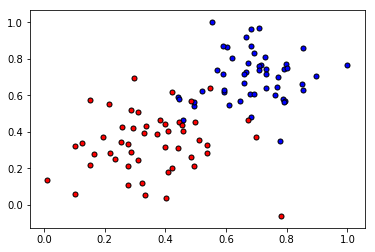

* 100 epochs, with each classifier line graphed:

    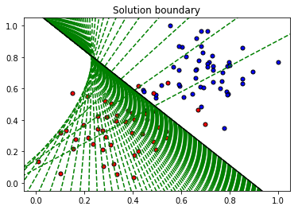

* Error function across 100 epochs:

    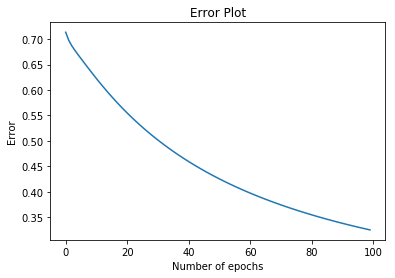

# 28 - Perceptron vs Gradient Descent

* Note that perceptrons points only update line if they are misclassified; however, with gradient descent, points always update line. Why?
    - They are telling the line to go farther away!

# 29 - Continuous Perceptrons

# 30 - Non-linear Data

# 31 - Non-linear Models

* Intuition: the non-linear model produces a classifier made up of points equally likely to be blue or red:

    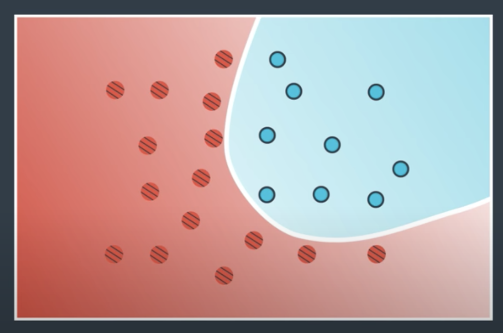

# 32 - Neural Network Architecture

* **multi-layer perceptrons**: another name for "neural networks"

* Can combine linear perceptrons to get more complex (non-linear) perceptrons
    - Basically, get probability for each point for all perceptrons, add them together, and take sigmoid to get the new probability:

    

* Note you can even add weights to these perceptrons, as well as add a bias:

    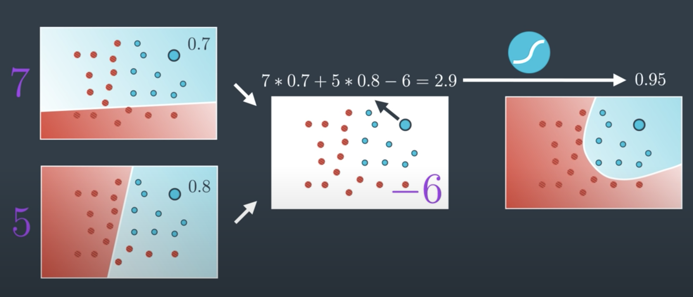

* :star: Complex neural networks are created out of linear combinations of existing neural networks.
    - I.e., non-linear models can be created using linear combinations of linear models.

* Here's the above example as a (non-linear) neural network:

    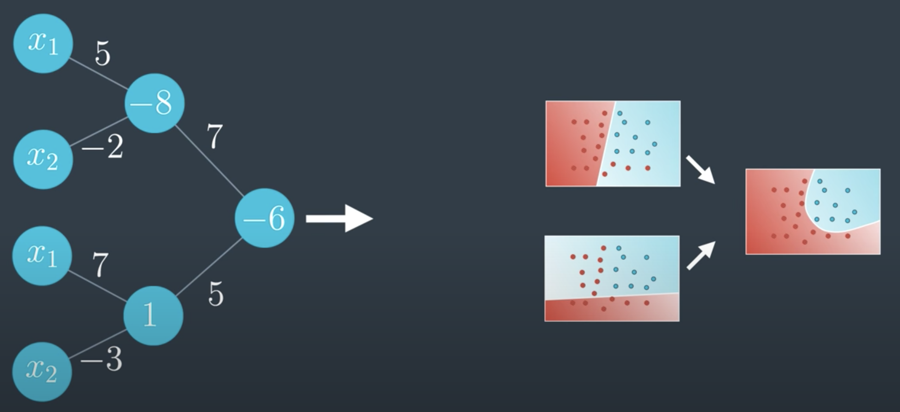

* The above can be represented more simply as:

    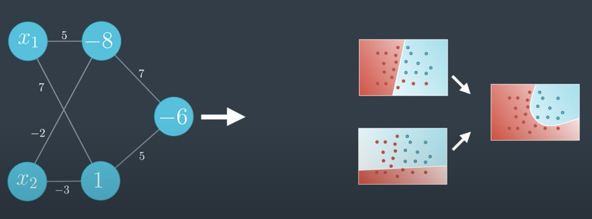

* Alternatively, the above represent the bias as a separate node:

    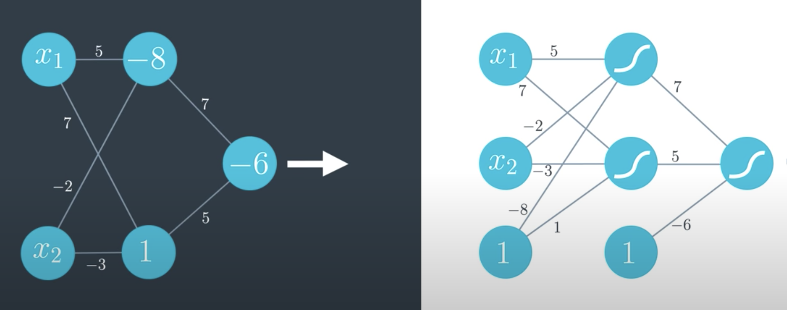

* E.g., let's define the combination of two new perceptrons as w₁*0.4 + w₂*0.6 + b. Given w₁ = 3, w₂ = 5, b = -2.2, what's the probability of this point?

    ```
    ŷ = 3 * .4 + 5 * 0.6 - 2.2
      = 2

    p(y) = 1/(1+e^-ŷ)
         = 1/(1+e^-2)
         = 0.880797078
    ```

* **Three layers of a neural network**: input layer, hidden layer, output layer:

    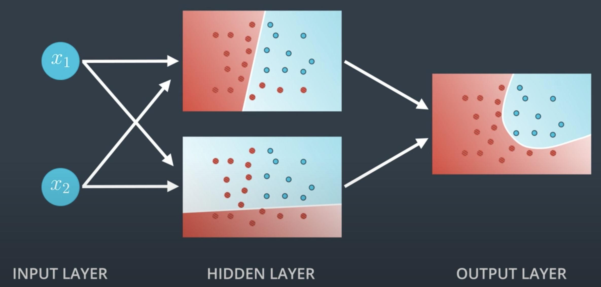

* Note if you add more inputs, the dimensionality increases. In general, if you have n input nodes, your output will be n dimensions:

    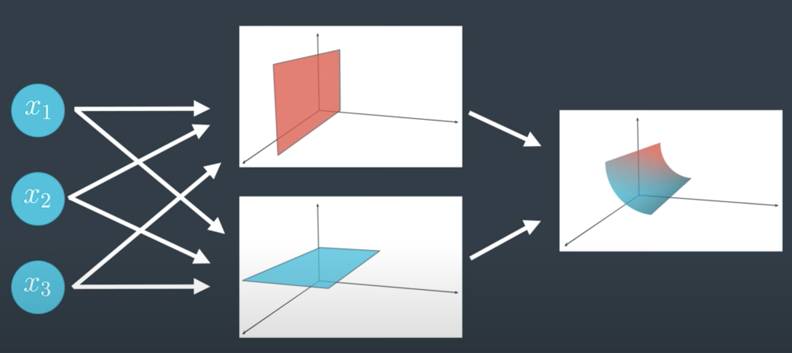

* If you have multiple output nodes, you have a **multi-class neural network**:

    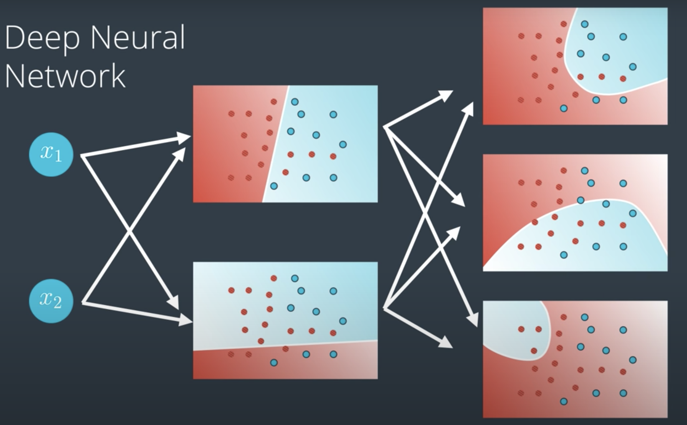

* **deep neural network**: neural network with more than one hidden layer:

    

* More layers give the model more degrees of freedom to capture complex patterns in the data:

    

# 33 - Feedforward

* **feedforward**: process neural networks use to turn the inputs into output(s)

* **feedforward formula**: ŷ = σ W⁽²⁾ ⚬ σ W⁽¹⁾x

* Feedforward with a single hidden layer:

    

* Feedforward with a multilayer neural network:

    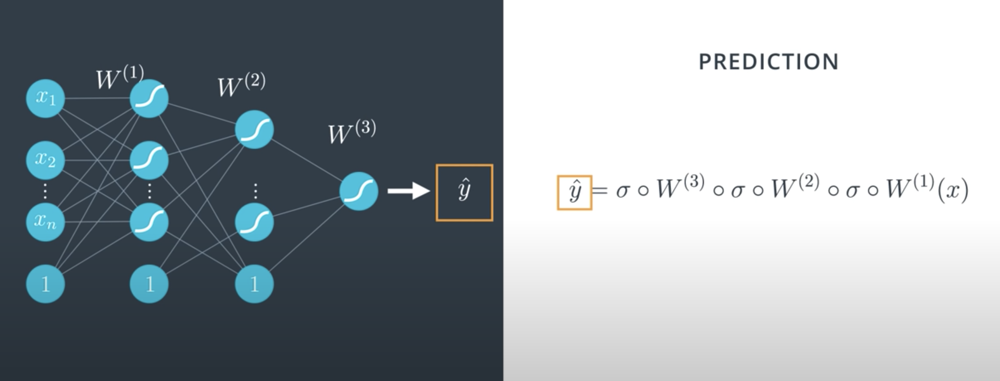

* error function for (binary classifier) neural network:

    ```
    E(W) = -1/m ∑ yᵢ ln(ŷ) + (1-yᵢ) ln(1-ŷ)
    ```

# 34 - Backpropogation

* The backpropogation process looks like this:
    1. Doing a feedforward operation.
    1. Comparing the output of the model with the desired output.
    1. Calculating the error.
    1. Running the feedforward operation backwards (backpropagation) to spread the error to each of the weights.
    1. Use this to update the weights, and get a better model.
    1. Continue this until we have a model that is good.

* **gradient of the error function**: ▽E = (∂E/∂w₁, ..., ∂E/∂wᵢ, ∂E/∂b)

    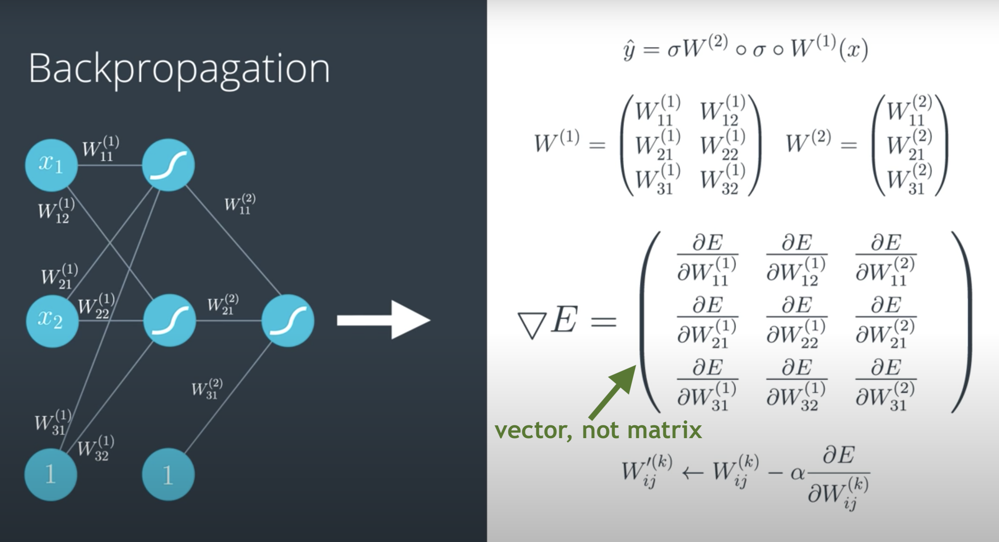

* Since we're using function composition, the chain rule allows us to multiply partial derivates together:
    - **chain rule**: if B = g ⚬ f(x) and A = f(x), ∂B/∂x = ∂B/∂A * ∂A/∂x

    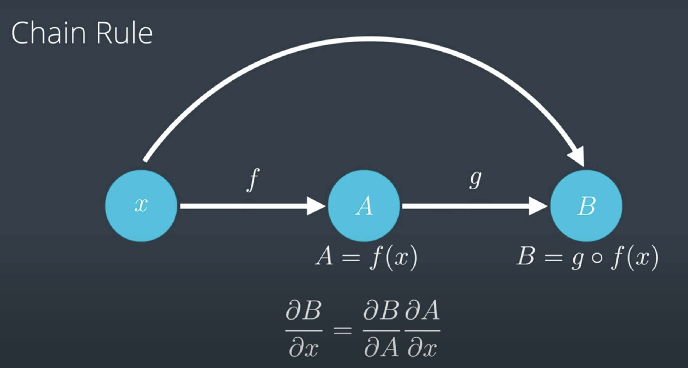

* To execute a neural network:
    1. Perform feedback:
        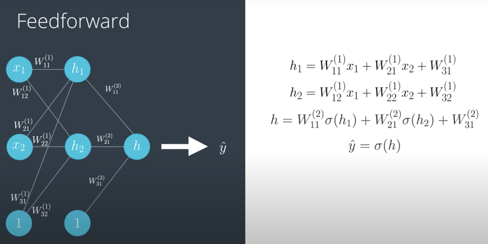
    2. Determine how to backpropagate, using chain rule:
        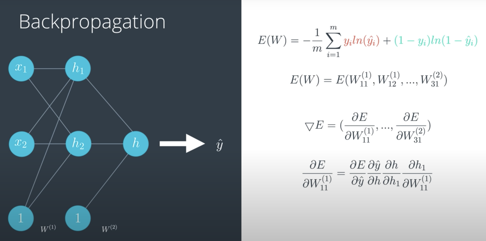
    3. The partial derivative of each node (in this example, `h`) is:
        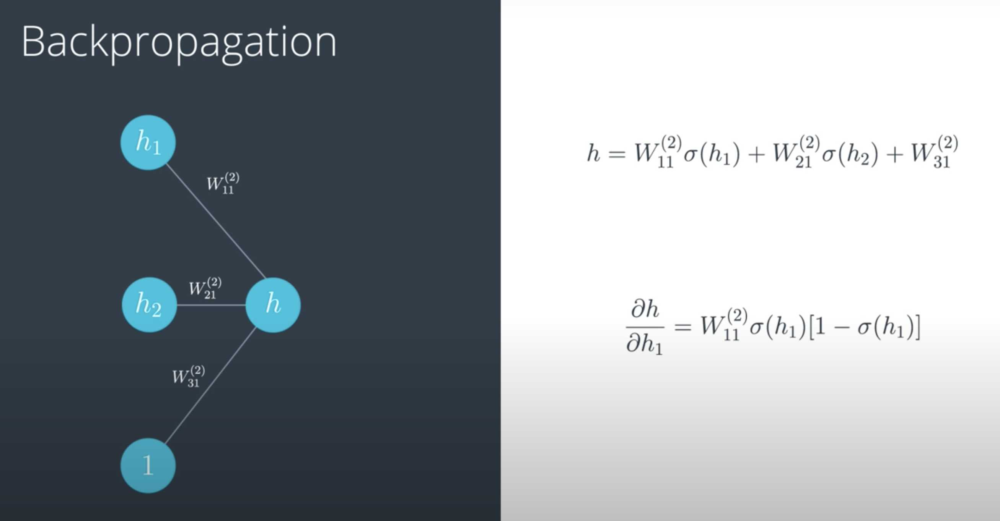

# 35 - Pre-lab: Analyzing Student Data

* Going to analyze student admissions at UCLA

# 36 - Notebook: Analyzing Student Data

# 37 - Outro
