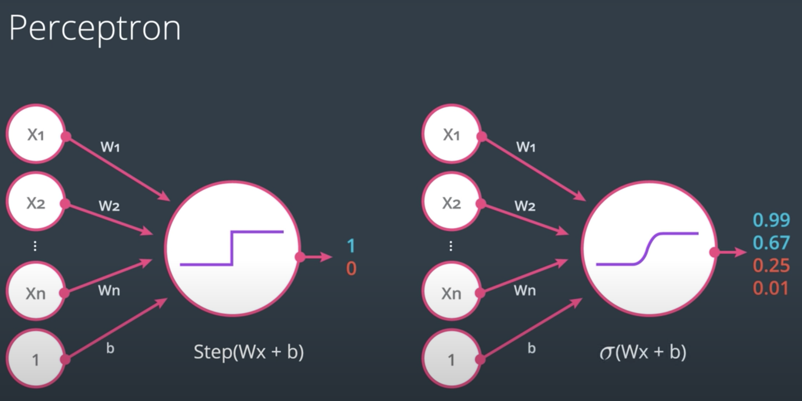

# Introduction to Neural Networks

## 1 - Instructor

## 2 - Introduction

* Deep learning use cases
1. AlphaGo and other game playing
1. Expert systems, sometimes outperforming exports (e.g., doctors)
1. Self-driving cars

## Lessons 3 - 7, 9 - 11
See: [Perceptron notes](../supervised-learning/perceptron)

# 8 - Why neural networks?

## 12 - Non-linear Regions

* Current perceptron algorithm only works for linearly separable problems

## 13 - Error functions

## 14 - Log-loss Error Function

* E.g., with gradient descent of a mountain, your error would be your height on the mountain

* If our error function is discrete, it can get stuck, as multiple options may have same error value

* Hence, we don't want our error function to be the number of misclassified points

* To apply gradient descent, function should be continuous and differentiable

## 15 - Discrete vs Continuous

* Activation function:
    - Should be continuous function (e.g., sigmoid) instead of discrete (e.g., step function)
    - This means that _every_ point has a probability of being correct

* **sigmoid function**: σ(x) = 1/(1+e⁻ˣ)

* Basically, our perceptron takes `W` and `b` (just like before), and generate a value that we feed into the sigmoid function:


* So our activation function for the second perceptron is the sigmoid function:



* Quiz: If the score is defined by 4x₁ + 5x₂ - 9 = score, then which of the following points has exactly a 50% probability of being blue or red?

```
[✓] (1,1)
[x] (2,4)
[x] (5,-5)
[✓] (-4,5)

We want to choose everything where 4x₁ + 5x₂ - 9 = 0, given σ(x=0) = 1/(1+e⁰) = 1/2.
```
