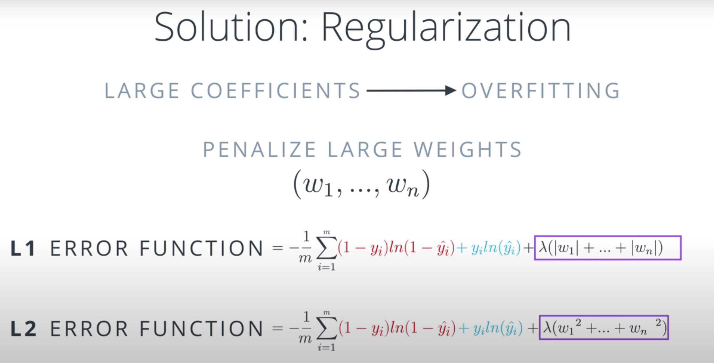

# Training Neural Networks

## 1. Instructor

## 2. Training Optimization

## 3. Testing

* Recap: choosing a better model by splitting data into training and testing data

## 4. Overfitting and Underfitting

* With neural networks, overfitting (larger network) is better than underfitting (smaller network); we'll find techniques that will help us deal with overfitting

## 5. Early Stopping

* **model complexity graph**: graphing the error (y-axis) for both training and testing against the model complexity (x-axis; e.g., number of epochs for NN).
    

* See how this neural network identifies a sweet spot between underfitting and overfitting (right before the testing error starts to increase):
    

* **early stopping**: training the neural network up until the testing error starts to increase

## 6. Regularization

## 7. Regularization 2

* Even for equations that are scalar multiples, formula with larger coefficients give smaller errors:
    

* However, smaller isn't always better! It seems like this model may be overfitting.

* It's harder to do gradient descent on models with very narrow error:
    

* Bad models can be very certain, whereas good models full of doubt.
    - Kind of similar to people, right?
    - "The fundamental cause of the trouble is that in the modern world the stupid are cocksure while the intelligent are full of doubt." - Bertrand Russel, "The Triumph of Stupidity"

* The idea is to add a new term to our error function that penalizes larger coefficients:
    

* **λ**: small letter lambda

* **L1 regularization**: adding λ(|w₁| + ... + |wᵢ|) term to error function
    - Good for feature selection, as tends to lead towards sparse matrix, e.g., (1, 0, 0, 1, 0)

* **L2 regularization**: adding λ(w₁² + ... + wᵢ²) term to error function
    - Normally better for training models

## 8. Dropout

* Sometimes, parts of the network develop strong weights while other parts don't really train much

* **dropout**: while training, randomly turn off some nodes during each epoch based on probability to prevent network. this form of regularization helps prevent interdependent learning and overfitting.

## 9. Local Minima

## 10. Random Restart

* **random restart**: training multiple models with randomly assigned parameters in order to avoid local minima.

## 11. Vanishing Gradient

* In multilayer perceptrons, the derivative of the error wrt a particular node is the multiple of all the nodes along the path to the output.
    - This is a problem with sigmoid activation functions, as these can produce very small numbers
    - I.e., the gradients of nodes closer to input are smaller, because they have more small numbers multiplier together
    - This is the **vanishing gradient problem**

## 12. Other Activation Functions

* The best solution for the vanishing gradient problem is to use other activation functions

* **hyperbolic tangent function**: tanh(x) = (eˣ - e⁻ˣ)/(eˣ + e⁻ˣ). similar to sigmoid activation function, but the range is between -1 and 1 results in larger derivatives.

* **Rectified Linear Unit** (**ReLU**): relu(x) = x if x >= 0, 0 if x < 0. Results in larger derivatives than sigmoid activation function.

* Even when using ReLU, we want our output node to be a sigmoid since we're classifying with probability
    - However, if we want a regression neural network, the output node can use ReLU!

## 13. Batch vs Stochastic Gradient Descent

* **stochastic gradient descent**: performing multiple small steps within each epoch using random subsets of data. reduces computational and memory requirements of gradient descent.

## 14. Learning Rate Decay

* **learning rate decay**: progressively decreasing learning rate to avoid divergence with large learning rates and slowness of small learning rates.

## 15. Momentum

* **momentum**: define constant β such that step(n) = step(n) + β step(n-1) + β² step(n-2) + ...

## 16. Error Functions Around the World
