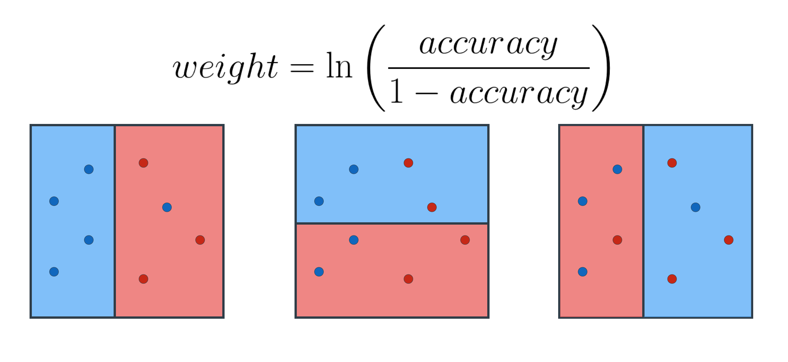
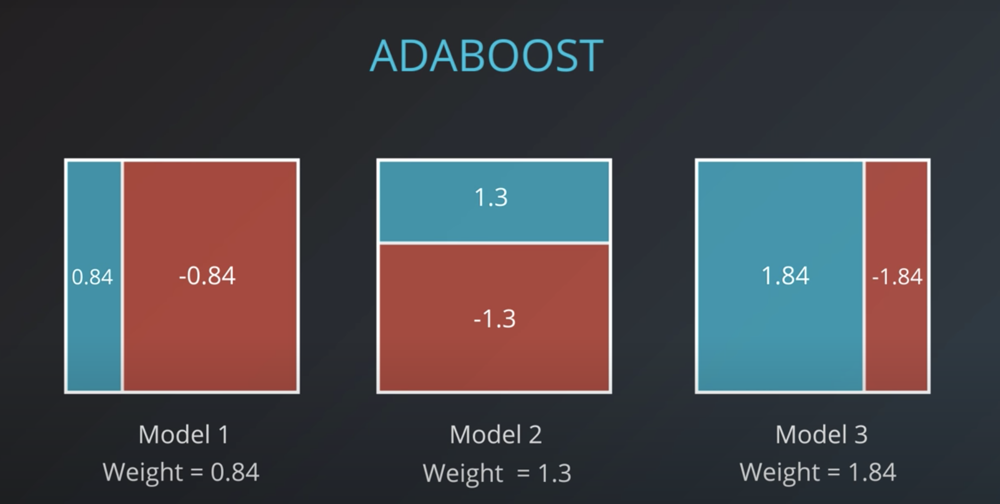
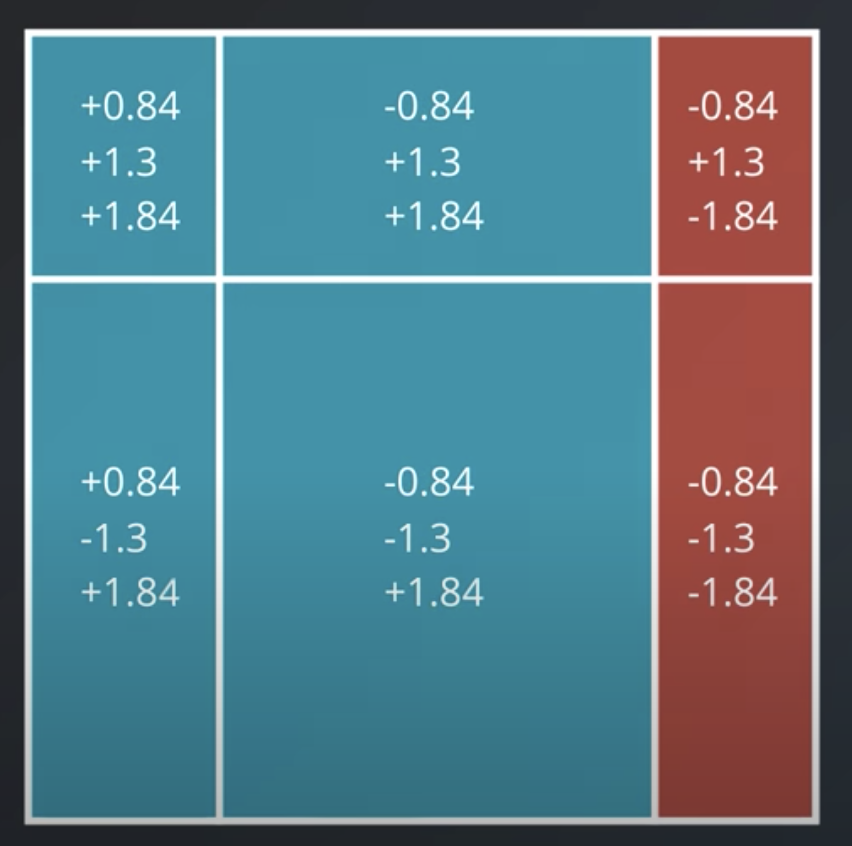
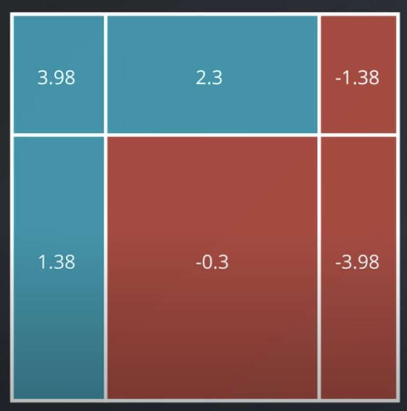

# Ensemble Methods

## 1. Intro

* Most common ensemble methods:
    - **Bagging** (bootstrap aggregating): build bunch of weak models using subset of data, then averaging or voting across models.
    - **Boosting**: when using a bunch of models, set weight for each model based on their strengths

* Individual models are called **weak learners**, and resulting ensemble method the **strong learner**

* Weak learners don't need to be very good; they just need to be slightly better than random

## 2. Ensembles

* Common weak learner is a decision tree

* **Bias**: error in which the model misses relevant relations in the data. Leads to underfitting. (Linear regression has high bias.)

* **Variance**: error from sensitivity to small fluctuations in the training set. Leads to overfitting. (Decision tree has high variance.)

* Common to introduce randomness into high variance algorithms prior to making ensemble. Two common ways to do this, which are both used in random forests:
    - **Bootstrapping**: sampling data with replacement and fitting algorithm to sample data
    - **Subsetting the features**: only use subset of features for each decision tree

## 3. Random Forests

* Decision trees overfit

* **Random forests** algorithm:
    1. Pick a subset of features, and build a decision tree
    2. Repeat step 1 _n_ times
    3. For each observation, run in all decision trees, and vote on solution

* There are better ways to pick features than randomly; we'll learn more later

## 4. Bagging

* Bagging algorithm:
    1. Build a weak model using subset of the data points
    2. Repeat step 1 _n_ times
    3. For each observation, run in all weak learners, and vote on solution

## 5. AdaBoost

* **Adaboost**: boosting algorithm that iteratively creates weak models, putting increasing weight on misclassifications

## 6. Weighting the Data

* Algorithm:
    1. All data points start with equal weights
    2. Create the first weak model. Figure out correct and incorrect weights (e.g., 7 and 3)
    3. Adjust weights of misclassified points by multiplying them by ratio of correct-to-incorrect values (e.g., 1pt * 7/3 = 7/3 pts). Now the ration of correct to incorrect weights is even (e.g., 7 and 7)
    4. Repeat steps 1 - 3 _n_ times, each time creating a new weak learner

## 7. Weighting the Models 1

## 8. Weighting the Models 2

* We want to weight truthful models close to 1, models that are half truthful close to 0, and models that consistently lie close to -1 (which makes the models that lie useful)

* Here's how we'll weight models:
    ```
    weight = ln(x / (1-x))
    ```
    Where `x` is the accuracy

* Shortcut:
    ```
    weight = ln(# correct / # incorrect)
    ```
* Recall:
    ```
    ln(x) = log(x)/log(e)
    ```

**Quiz**:



What's the weight for each?

```
weight₁ = ln((7/8)/(1/8))
        = log(7/1)/log(e)
        = 1.95

weight₂ = ln((4/8)/(4/8))
        = log(1)/log(e)
        = 0

weight₃ = ln((2/8)/(6/8))
        = log(2/6)/log(e)
        = -1.1
```

## 9. Weighting the Models 3

* If you have a weak learner that is 100% correct, its weight will be `∞`

* If you have a weak learner that is 100% incorrect, its weight will be `-∞`

* In practice, neither of these are likely

## 10. Combining the Models

Assign the weights of each model to the positive and negative areas:



Now create a new model:



After summing, when the value is positive we classify as blue, and when negative, we classify as red:



## 11. AdaBoost in sklearn

Usage:

```python
from sklearn.ensemble import AdaBoostClassifier
model = AdaBoostClassifier()
model.fit(x_train, y_train)
model.predict(x_test)
```

Most common hyperparameters:
* **base_estimator**: model utilized for the weak learners
* **n_estimators**: number of weak learners to use

E.g.,
```python
from sklearn.tree import DecisionTreeClassifier
model = AdaBoostClassifier(base_estimator = DecisionTreeClassifier(max_depth=2), n_estimators = 4)
```

## 12. More Spam Classifying

General process for using ML model:
1. Import the model.
2. Instantiate the model with the hyperparameters of interest.
3. **Fit** the model to the training data.
4. **Validate** (**predict**) on the test data.
5. **Score** the model by comparing the predictions to the actual values.

Bagging with scikit-learn:

```python
from sklearn.ensemble import BaggingClassifier

model = BaggingClassifier(n_estimators = 200)
model.fit(training_data, y_train)
predictions = model.predict(testing_data)
```

Random Forests with scikit-learn:

```python
from sklearn.ensemble import RandomForestClassifier

model = RandomForestClassifier(n_estimators = 200)
model.fit(training_data, y_train)
predictions = model.predict(testing_data)
```

## 13. Recap & Additional Resources


## More info
* [scikit-learn Ensemble methods](https://scikit-learn.org/stable/modules/ensemble.html)
* [A Short Introduction to Boosting](https://cseweb.ucsd.edu/~yfreund/papers/IntroToBoosting.pdf): the original paper (1999, 14pp)
* [Explaining AdaBoost](http://rob.schapire.net/papers/explaining-adaboost.pdf): useful tutorial (16pp)
