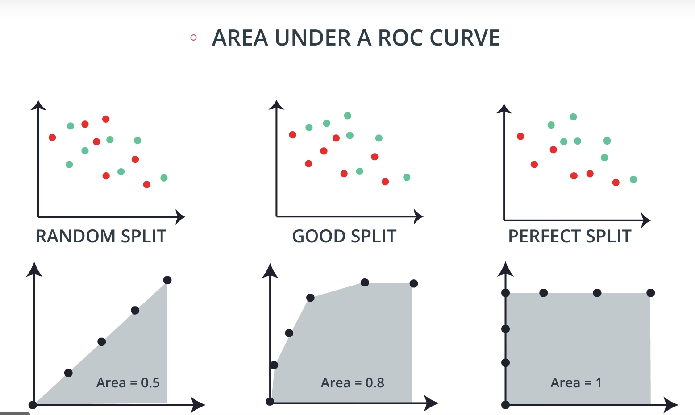
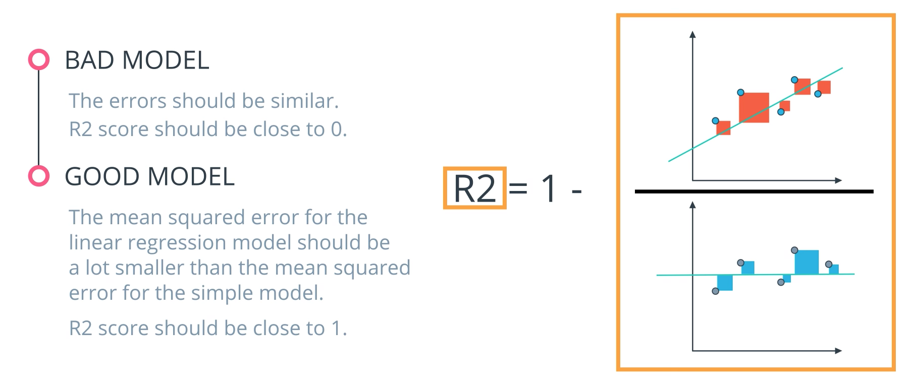

# Model Evaluation Metrics

## 1. Intro

* Two question we want to answer:
    1. How well is our model doing?
    2. How do we improve our model?

## 2. Outline

## 3. Testing your models

* Splitting data into training and testing sets

* Overfit models may have less error on the training data, but they generalize poorly and have more error error on testing data

* Thou shalt never use your testing data for training

```python
from sklearn.tree import DecisionTreeClassifier
from sklearn.metrics import accuracy_score
# sklearn 0.18 and later:
#   from sklearn.model_selection import train_test_split
from sklearn.cross_validation import train_test_split
import pandas as pd
import numpy as np

data = np.asarray(pd.read_csv('data.csv', header=None))

X = data[:,0:2]
y = data[:,2]

X_train, X_test, y_train, y_test = \
    train_test_split(X, y, test_size = 0.25, random_state = 42)

model = DecisionTreeClassifier()
model.fit(X_train, y_train)

y_pred = model.predict(X_test)

acc = accuracy_score(y_test, y_pred)
print(acc)
```

## 4. Confusion matrix

| | Diagnosed Sick | Diagnosed Healthy |
| --- | --- | --- |
| **Sick** | True Positive | False Negative |
| **Healthy** | False Positive | True Negative |

* **confusion matrix**: table used to store true and false positives/negatives, in order to help determine how well a model is doing:

| | Diagnosed Sick | Diagnosed Healthy |
| --- | --- | --- |
| **Sick** | 1000<br>(True Positive) | 200<br>(False Negative) |
| **Healthy** | 800<br>(False Positive) | 8000<br>(True Negative) |

* **Type 1 Error**: aka False Positive

* **Type 2 Error**: aka False Negative

## 5. Confusion matrix 2

## 6. Accuracy

* **Accuracy**: what percentage of data points did we classify correctly? (TP + TN) / (TP + FP + TN + FN)

```python
import sklearn.metrics import accuracy_score
accuracy_score(y_true, y_pred)
```

## 7. Accuracy 2

* When the data is highly skewed, accuracy isn't a good measure of success

## 8. When accuracy won't work

## 9. False Negatives and Positives

* False Negative is worse in a situation where failing to diagnose someone who is sick

* False Positive is worse when sending grandma's email to spam folder

## 10. Precision and Recall

## 11. Precision

* **precision**: TP / (TP + FP). Out of all data predicted to be data, how many are actually positive? Punishes false positives.

## 12. Recall

* **recall**: TP / (TP + FN). Out of all the positive data, how many were predicted to be positive? Punishes false negatives. (aka the "true positive rate", or "sensitivity".)

## 13. F₁ Score

* **harmonic mean**: 2xy / (x + y). Always less than arithmetic mean.

* **F₁ Score**: 2 * Precision * Recall / (Precision + Recall). I.e., the harmonic mean of precision and recall.

## 14. F-beta Score

* **Fᵦ Score**: (1 + β) * Precision * Recall / (β * Precision + Recall). Large β yields better recall, low β yields better precision.

## 15. ROC Curve

* **false positive rate**: FP / (TN + FP).

* **Receiver Operator Characteristic (ROC) curve**: Graph all points using the true positive rate and false negative rates as (x,y) coordinates, respectively. Closer the area under curve is to one, better the model is.



## 16. Sklearn Practice (Classification)

```python
def precision(actual, preds):
    TP = (preds == 1) & (actual == 1)
    return np.sum(TP)/np.sum(preds == 1)
```

```python
def recall(actual, preds):
    TP = (preds == 1) & (actual == 1)
    FN = (preds == 0) & (actual == 1)
    return np.sum(TP) / (np.sum(TP) + np.sum(FN))
```

## 17. Regression Metrics

* **mean absolute error**: measure performance of regression by adding absolute value of the distances of the points from the line. Not suitable for gradient descent, as cannot differentiate between positive and negative.


```python
from sklearn.metrics import mean_absolute_error
from sklearn.linear_model import LinearRegression

classifier = LinearRegression()
classifier.fit(X, y)

guesses = classifier.predict(X)

error = mean_absolute_error(y, guesses)
```

* **mean squared error**: measure performance of regression by adding squares of distances between points and line.


```python
from sklearn.metrics import mean_squared_error
from sklearn.linear_model import LinearRegression

classifier = LinearRegression()
classifier.fit(X, y)

guesses = classifier.predict(X)

error = mean_squared_error(y, guesses)
```

* **R2 score**: 1 - mean_squared_error(regression_model) / mean_squared_error(simplest_regression_model). A good model should yield value closer to 1.



```python
from sklearn.metrics import r2_score

y_true = [1, 2, 4]
y_pred = [1.3, 2.5, 3.7]

r2_score(y_true, y_pred)
```

## 18. Sklearn Practice (Regression)

## 19. Text: Recap

## 20. Summary
