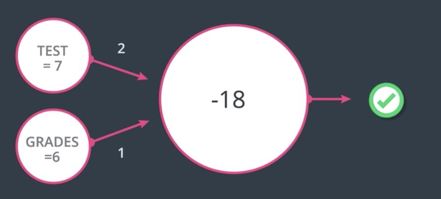
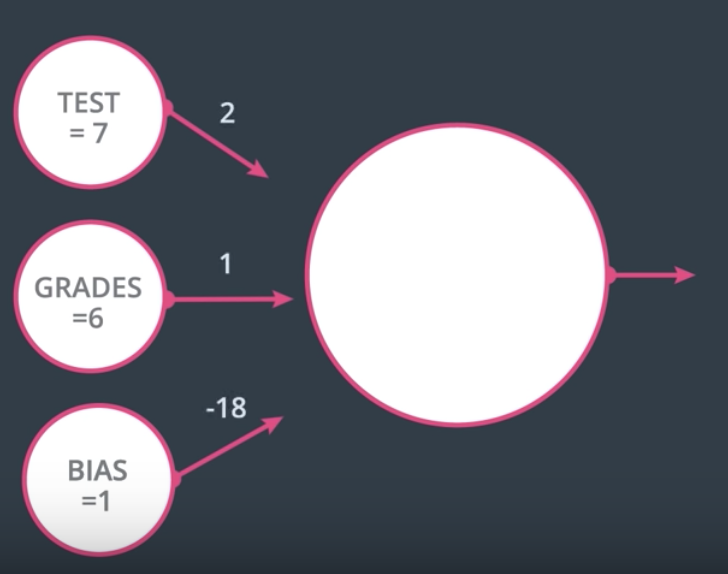
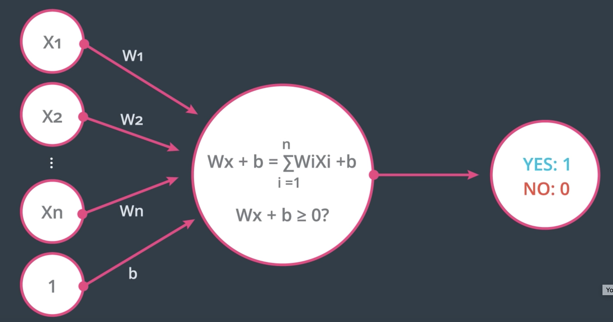
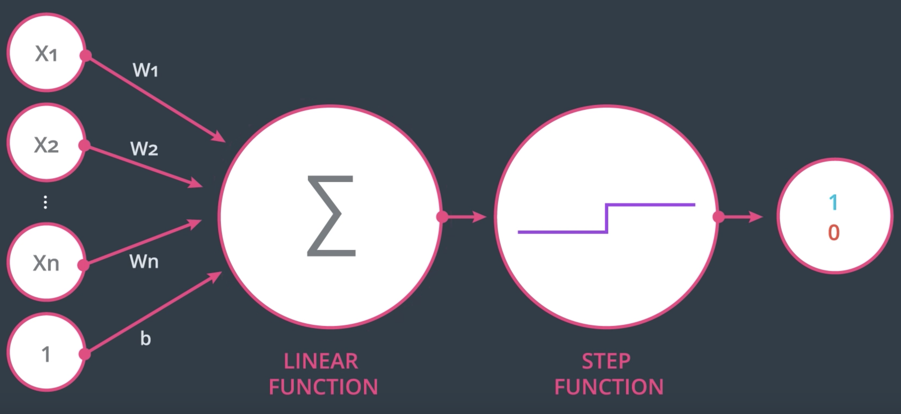

## 1. Intro

## 2. Classification Problems 1

## 3. Classification Problems 2

## 4. Linear Boundaries

* Boundary will be `w₁x₁ + w₂x₂ + b = 0`

* Vectorized, the formula is:
    ```
    Wx + b = 0
    W = (w₁, w₂)
    x = (x₁, x₂)
    ```
  Where `x` is the **input**, `w` is the **weights**, `b` is the **bias**, a `y` is the **label** (0 or 1)

 * Prediction `ŷ`:
    ```
    ŷ = 1 if Wx + b ≥ 0
    ŷ = 0 if Wx + b < 0
    ```

## 5. Higher Dimensions

* Boundary will be `w₁x₁ + w₂x₂ + w₃x₃ + b = 0`

* Vector formula is still `Wx + b = 0`, and `ŷ` formula same

* If n dimensions (`x₁`, `x₂`, ..., `xᵣ`), then boundary is n-1 hyperplane in n-dimensional space

## 6. Perceptrons

* Say we have our college admissions example:
    ```
    Score = 2 * Test + 1 * Grades - 18
    Score >= 0 Accept
    Score < 0 Reject
    ```
* One way to represent our perception is to consider `2` and `1` as connection weights, and `-18` as the bias value of a node:



* Alternatively, can also treat `-18` as a weight for a fixed input value of `1`:



* The general case of a perceptron with n inputs:



* The pattern includes a linear function and a step function:



* In the above example, a **step function** returns `1` in some cases (if input is positive), or `0` in other cases (if input is negative)
    - We'll use different step functions later, which is why it is useful to specify in node

## 7. Perceptrons as Logical Operators

* Some logical operators can be represented as perceptrons

### AND perceptron

| Input | Input | Output |
| ----- | ----- | ------ |
| ✓ | ✓ | ✓ |
| ✓ | x | x |
| x | ✓ | x |
| x | x | x |


No unique solution, but can use weights of `2`, `2`, and bias of `-3`:

| Input | Input | Bias | Linear Fn | Step Fn |
| ----- | ----- | ---- | ------ | ------ |
| 2 | 2 | -3 | 1 | ✓ |
| 2 | 0 | -3 | -1 | x |
| 0 | 2 | -3 | -1 | x |
| 0 | 0 | -3 | -3 | x |

### OR perceptron

| Input | Input | Output |
| ----- | ----- | ------ |
| ✓ | ✓ | ✓ |
| ✓ | x | ✓ |
| x | ✓ | ✓ |
| x | x | x |


* Solution is like AND perceptron; can either increase the input weights or decrease the bias. E.g., use weights `2`, `2` and bias `-1`:

| Input | Input | Bias | Linear Fn | Step Fn |
| ----- | ----- | ---- | ------ | ------ |
| 2 | 2 | -1 | 3 | ✓ |
| 2 | 0 | -1 | 1 | ✓ |
| 0 | 2 | -1 | 1 | ✓ |
| 0 | 0 | -1 | -1 | x |

### NOT perceptron

* This is unary; only cares about one input.

* Solution: use weights `0`, `-1`, and bias `0`:

| Input | Input | Bias | Linear Fn | Step Fn |
| ----- | ----- | ---- | ------ | ------ |
| 1 * 0 | 1 * -1 | 0 | -1 | x |
| 1 * 0 | 0 * -1 | 0 | 0  | ✓ |
| 0 * 0 | 1 * -1 | 0 | -1 | x |
| 0 * 0 | 0 * -1 | 0 | 0  | ✓ |

### NAND operator

* This will be our first **multi-layer perceptron**

* **NAND operator** is AND followed by NOT

### XOR perceptron

* This will be our second **multi-layer perceptron**


## 8. Perceptron trick

* Say we have linear equation `3x₁ + 4x₂ - 10 = 0` with:
    ```
    Positive region: 3x₁ + 4x₂ -10 ≥ 0
    Negative region: 3x₁ + 4x₂ -10 < 0
    ```
    With misclassified point `(4,5)`, which should be `FALSE`. Given the point is _above_ the line, we could subtract the misclassified point from the coefficients of the line:
    ```
        3   4   -10
    -   4   5   1 (bias unit)
        -----------
        -1  -1  -11
    ```
    However, this is a very drastic change. Instead, we'll apply the **learning rate**:
    ```
    learning rate: 0.1
    point * learning rate: 4   5   1   ->  .4  .5  .1

        3   4   -10
    -   0.4 0.5 0.1
        -----------
        2.6 3.5 -10.1
    ```
    Out new equation is `2.6x₁ + 3.5x₂ - 10.1 = 0`.

* If there's a misclassified point (should be positive) _below_ the line, you should add instead of subtract. E.g., line `3x₁ + 4x₂ - 10 = 0` with point `(1,1)`:
    ```
        3   4   -10
    +   0.1 0.1 0.1
        -----------
        3.1 4.1 -9.9
    ```
    New line: `3.1x₁ + 4.1x₂ - 9.9 = 0`

## 9. Perceptron Algorithm

1. Start with random weights, `w₁`, `w₂`, ..., `wᵣ`, `b`
2. For every misclassified point in `(x₁, x₂, ..., xᵣ)`:
    ```
    if prediction == 0 (but should be 1):
        for i = 1 ... n
            wᵢ ← wᵢ + α xᵢ
        b ← b + α

    if prediction == 1 (but should be 0):
        for i = 1 ... n
            wᵢ ← wᵢ - α xᵢ
        b ← b - α
    ```
