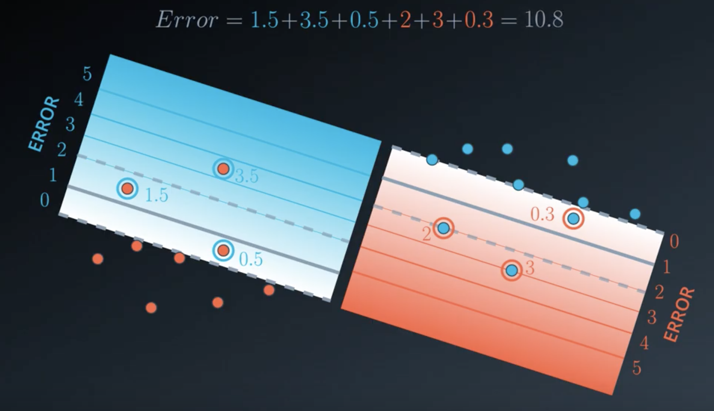
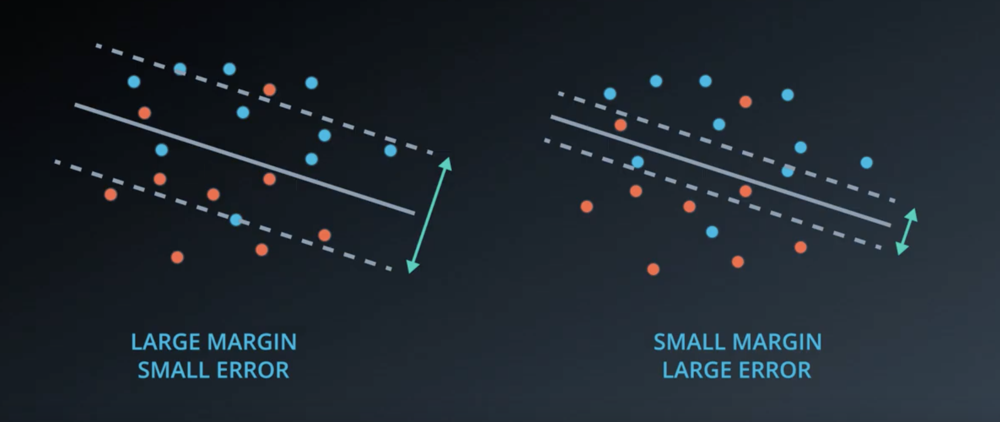
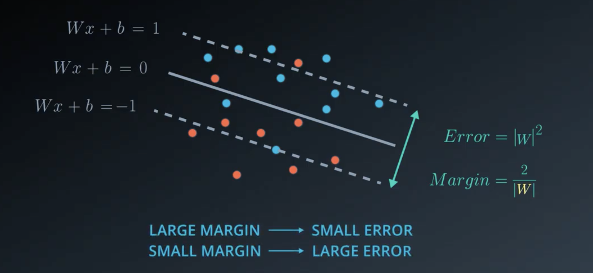
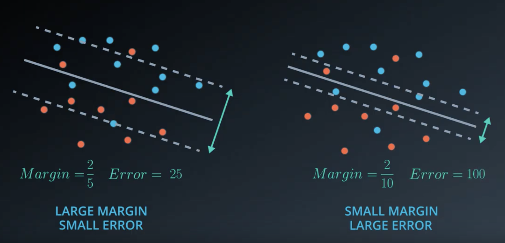
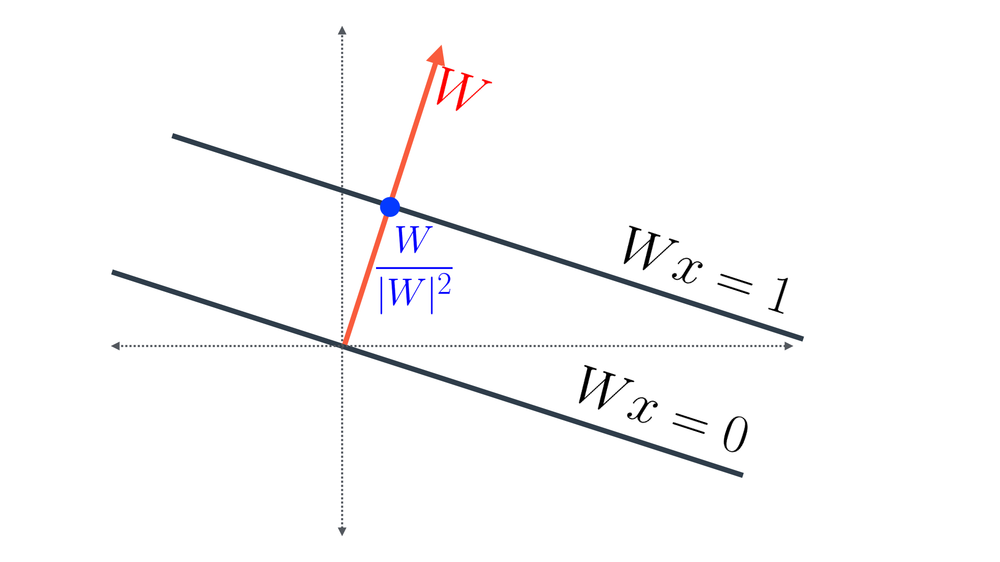

# Support Vector Machines

## 1. Intro

* Intuition: SVMs find the boundary that maintains the largest distance from the points

## 2. Which line is better?

## 3. Minimizing distances

## 4. Error function intuition

* Intuition: our new error will be classification error + margin error

## 5. Perceptron algorithm

* The formula for the **boundary of an SVM** is the same as a perceptron:
    ```
    w₁x₁ + w₂x₂ + b = 0
    ```
* The idea: add up distance from all misclassified points to the boundary, and use gradient descent to find the ideal values of `w` and `b` to minimize this error

## 6. Classification error

* We don't just want the boundary `w₁x₁ + w₂x₂ + b = 0`; we also want the lines that create the **margins of an SVM**, `w₁x₁ + w₂x₂ + b = 1` and `w₁x₁ + w₂x₂ + b = -1`

* **Classification error** is the sum of the distance from the closest margin line, _not_ the boundary line:



## Aside: About vector norms

Source: "[Gentle Introduction to Vector Norms in Machine Learning](https://machinelearningmastery.com/vector-norms-machine-learning/)"

* The **norm of a vector** are different ways to calculate the the length (or magnitudes) of vectors
    - Given 3d vector `v = (a,b,c)`
    - **L1 norm** is the sum of the absolute values of the vector, `l₁(v) = ||v||₁ = |a₁| + |a₂| + |a₃|`
    - **L2 norm** is the square root of the squared vector values, `l₂(v) = ||v||₂ = sqrt(a₁² + a₂² + a₃²)`

* Can use NumPy to calculate vector norms. E.g.,
    ```python
    from numpy import array
    from numpy.linalg import norm
    a = array([1, 2, 3])
    l1 = norm(a, 1)
    print(l1)   # 6.0
    ```

## Aside: Why linear algebra?

Source: "[Basics of Linear Algebra for Machine Learning](https://machinelearningmastery.com/linear_algebra_for_machine_learning/)"

* A **tensor** is an array with more than two dimensions

* Linear algebra is essentially the mathematics of data

* In ML, we're always dealing with vectors and matrices

* To learn ML, don't learn linear algebra, then calculus, then probability, then statistics, and eventually ML; that's the slow bottom-up path

* Instead, start with systematic procedures that get results, then work back to deeper understanding of theory; this is the results-first approach

* Only a specific subset of linear algebra is required for ML

## 7. Margin error

* The goal of **margin error** is to punish small margins:

    

* Like classification error, we want to use gradient descent to minimize the margin error

* The formula for the margin error:

    

    Where `|W|` is the norm of the vector `W`, which is the square root of the sum of the squares of the components of `W`:

* Given the formula for the boundary `w₁x₁ + w₂x₂ + b = 0`, example 1:
    ```
    W = (3,4)   b = 1
    Boundary = 3x₁ + 4x₂ + 1 = 0

    Margins = {
        3x₁ + 4x₂ + 1 = 1,
        3x₁ + 4x₂ + 1 = -1
    }

    Error = |W|² = 3² + 4² = 25
    Margin = 2/|W| = 2/5
    ```

* Example 2 has the same boundary line as example 1, but `W` and `b` are doubled:
    ```
    W = (6,8)   b = 2
    Boundary = 6x₁ + 8x₂ + 2 = 0

    Margins = {
        6x₁ + 8x₂ + 2 = 1,
        6x₁ + 8x₂ + 2 = -1
    }

    Error = |W|² = 6² + 8² = 100
    Margin = 2/|W| = 2/10 = 1/5
    ```

    If these boundary lines are the same, why is the error so much larger for example 2?

    Because our margins take the form `w₁x₁ + w₂x₂ + b = 1` and `w₁x₁ + w₂x₂ + b = -1`, the margins are half the size for example 2 than example 1, and the error is four times greater.

* In summary, the above examples 1 and 2 have the same boundary lines, but different margins:

    

## 8. (Optional) Margin error calculation

```
W = (w₁,w₂)    x = (x₁,x₂)    Wx = w₁x₁ + w₂x₂

Wx + b = 1
Wx + b = 0
Wx + b = -1
```

We just need to find the distance between two of these lines and multiply by 2, since they are parallel. We also don't care about `b` because they are parallel, and we can remove `b` without impact their distance. So:

```
Wx = 0
Wx = 1
```

Note that the vector `W` is orthonal to the margins:


Say that `W` intercepts `Wx = 1` at point `(p,q)`. Then two things are true:
1. `w₁p + w₂q = 1`
2. `(p,q)` is a multiple of `(w₁,w₂)`, since it's a point on the vector `W`

Per #2 above, let `(p,q) = k * (w₁,w₂)` for some unknown `k`.

Given this, we can rewrite #1 as:

```
w₁p + w₂q = 1
k * p * p + k * q * q = 1
k * (p² + q²) = 1
```

Therefore:

```
k = 1 / (w₁² + w₂²)
  = 1/|W|²
```

And hence the new vector is:

```
(p,q) = k * (w₁,w₂)
      = 1/|W|² * (w₁,w₂)
      = W/|W|²
```



The distance between the two margins is the norm of the new vector:


Given there are two margins, the total distance is `2/|w|`.
