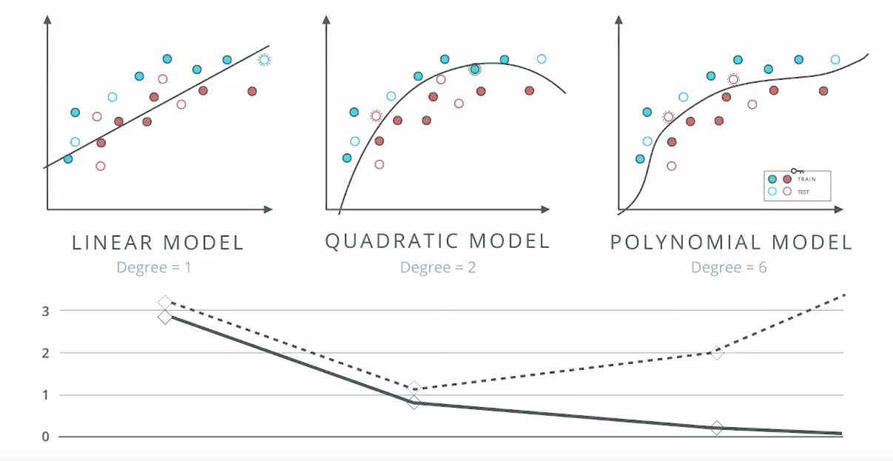
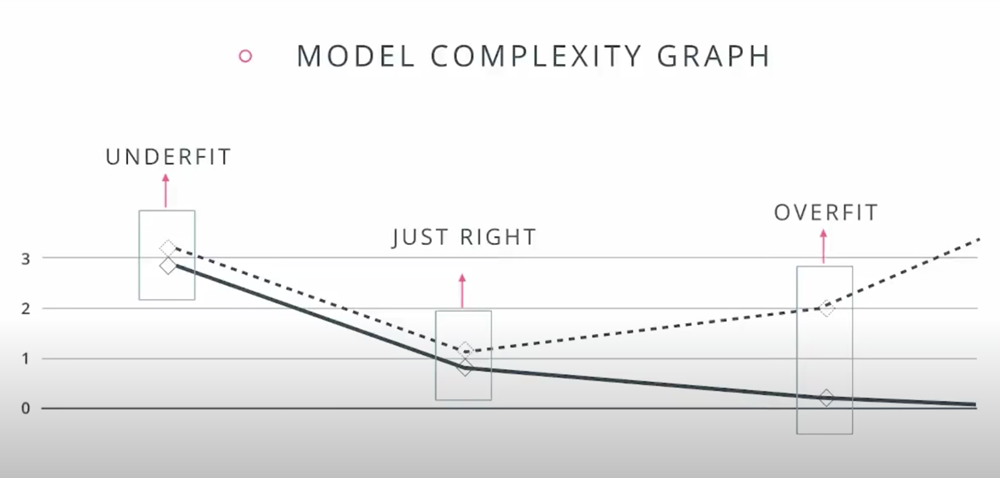
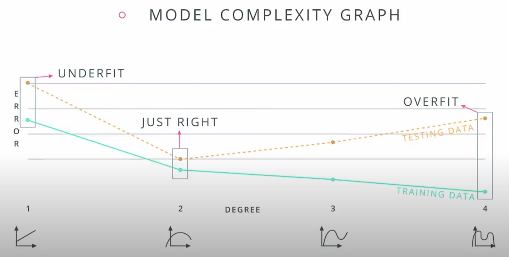
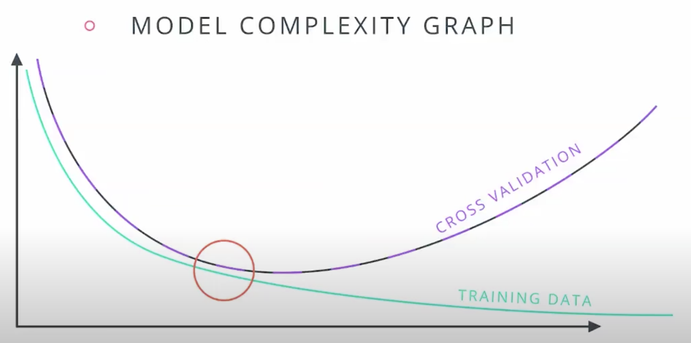
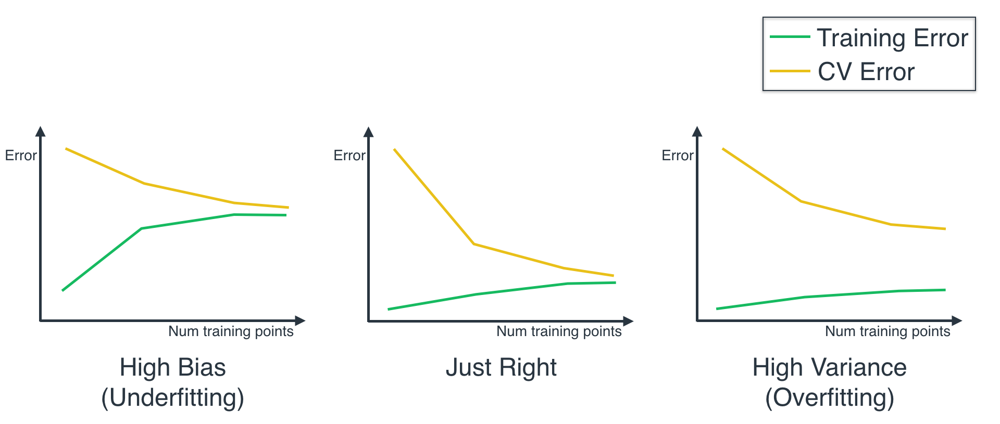
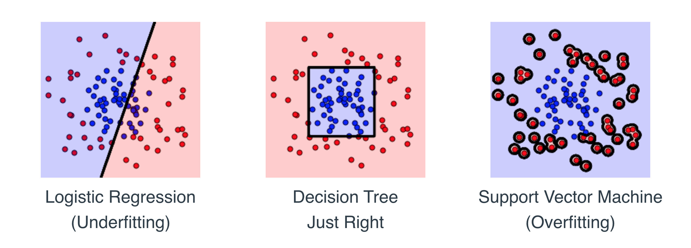
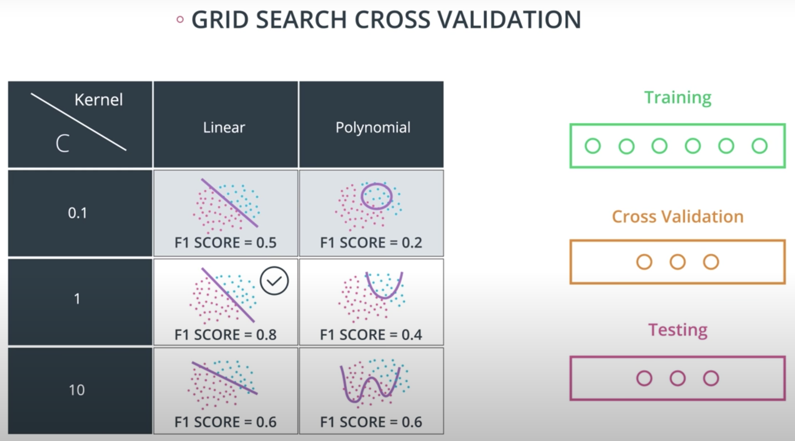

# Training and Tuning

## 1 - Types of Errors

* **Underfitting**: Oversimplifying. Error due to bias. Doesn't do well on training set.

* **Overfitting**: Overcomplicating; model too specific. Error due to variance. Doesn't do well on testing set.

|     | High bias (underfitting) | Good model | High variance (overfitting) |
| --- | ------------------------ | ---------- | --------------------------- |
| **How it models the problem** | Oversimplifies | - | Overcomplicates |
| **Training dataset performance** | Bad | Good | Great |
| **Testing dataset performance** | Bad | Good | Bad |

## 2 - Model Complexity Graph



## 3 - Cross Validation

* These graphs help us understand if our model is underfit or overfit, and it's tempting to use them to select a model...





* However, selecting a model based on these graphs would break our golden rule: never use our testing data for training.

* We should split our data into training, cross-validation, and testing data sets

| Data Set | Purpose |
| -------- | ------- |
| Training | Training our model |
| Cross-validation | Choosing a model |
| Testing | Final testing |

* Here's our corrected **model complexity graph**, which graphs training and cross-validation errors across our models to help us identify underfitting and overfitting:




## 4 - K-Fold Cross Validation

* **K-fold cross validation**: break data into `k` buckets (potentially randomizing), and train model `k` times, using one bucket for testing set and remaining buckets as training set; then average results for final model.

```python
from sklearn.model_select import KFold

kf = KFold(12, 3, shuffle=True)
for training_indices, test_indices in kf:
    # train and test model(s)
```

## 5 - Learning Curves

* **Learning Curves**: graph errors as increase number of data points for both training and cross-validation. Used to flag underfitting and overfitting.



## 6 - Detecting Overfitting and Underfitting

## 7 - Solution: Detecting Overfitting and Underfitting




**Important**: in the graph above, the y axis is *score*, which is the inverse of *error*. You have to flip the values in your mind. Even still, they don't match our expectations exactly; making this tricky.

## 8 - Grid Search

* Basic approach to ML:
    1. Train a bunch of models (using training data)
    2. Pick the best model (using cross-validation data)
    3. Test the model (using testing data)

* **Hyperparameters**:

* Examples of hyperpaarmeters:
    - Logistic regression: the degree of polynomial (1, 2, 3...); not the parameters themselves, which are just "parameters"
    - Decision tree: the depth
    - SVM: the kernel, `C`

* When exploring numeric hyperparameters (e.g., `C` for SVM), consider incrementing by orders of magnitude to reduce search space

* **Grid Search**:

* Here's an example of a grid search across two parameters for an SVM model:



## 9 - Grid Search in sklearn

```python
from sklearn.metrics import f1_score, make_scorer
from sklearn.model_selection import GridSearchCV

parameters = {'kernel':['poly', 'rbf'],'C':[0.1, 1, 10]}

scorer = make_scorer(f1_score)

grid_obj = GridSearchCV(clf, parameters, scoring=scorer)

grid_fit = grid_obj.fit(X, y)

best_clf = grid_fit.best_estimator_
```

Now you can use this estimator `best_clf` to make the predictions.

## 10 - Grid Search lab

```python
from sklearn.metrics import make_scorer
from sklearn.model_selection import GridSearchCV

clf = DecisionTreeClassifier(random_state=42)

parameters = {
    'max_depth':list(range(2, 10)),
    'min_samples_leaf':list(range(2, 10)),
    'min_samples_split':list(range(2, 10))
}

scorer = make_scorer(f1_score)

grid_obj = GridSearchCV(clf, parameters, scoring=scorer)

grid_fit = grid_obj.fit(X_train, y_train)

# Get the estimator.
best_clf = grid_fit.best_estimator_

# Fit the new model.
best_clf.fit(X_train, y_train)

# Make predictions using the new model.
best_train_predictions = best_clf.predict(X_train)
best_test_predictions = best_clf.predict(X_test)

# Calculate the f1_score of the new model.
print('The training F1 Score is', f1_score(best_train_predictions, y_train))
print('The testing F1 Score is', f1_score(best_test_predictions, y_test))
```

## 11 - Solution: Grid Search lab

```python
# build a classifier
clf_rf = RandomForestClassifier()

# Set up the hyperparameter search
param_dist = {"max_depth": [3, None],
              "n_estimators": list(range(10, 200)),
              "max_features": list(range(1, X_test.shape[1]+1)),
              "min_samples_split": list(range(2, 11)),
              "min_samples_leaf": list(range(1, 11)),
              "bootstrap": [True, False],
              "criterion": ["gini", "entropy"]}


# Run a randomized search over the hyperparameters
random_search = RandomizedSearchCV(clf_rf, param_distributions=param_dist)

# Fit the model on the training data
random_search.fit(X_train, y_train)

# Make predictions on the test data
rf_preds = random_search.best_estimator_.predict(X_test)

ch.print_metrics(y_test, rf_preds, 'random forest')
```

## 12 - Putting it all together

## 13 - Outro
