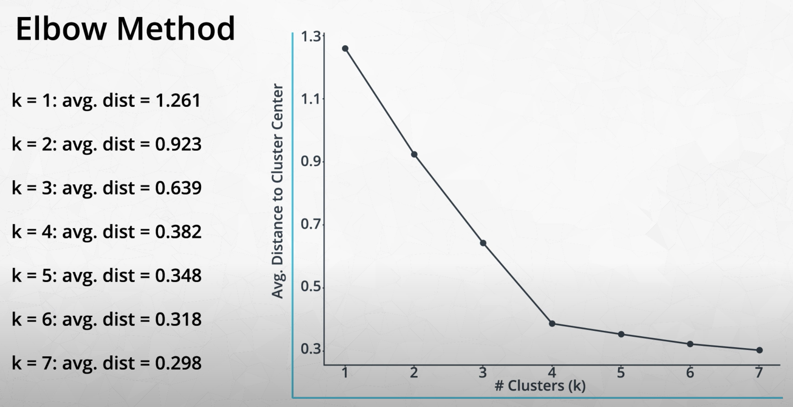

# Clustering

## 1. Introduction

## 2. Course Overview

## 3. Two Types of Unsupervised Learning

1. clustering
2. dimensionality reduction

## 4. K-Means Use Case

## 5. K-Means

* group data points into k different groups

## 6. Identifying Clusters

## 7. Changing K

* In practice, changing K is a combination of art and science

## 8. Elbow Method

* **elbow method**: plotting the number of clusters K (x-axis) against the avg distance to cluster center (y-axis), and looking for the point where the decrease in distance becomes small
    

## 9. K-Means in Scikit Learn

```python
import sklearn.cluster.KMeans

kmeans_4 = KMeans(4)
model_4 = kmeans_4.fit(data) # alternatively, combine fit and predict w/ fit_predict
labels_4 = model_4.predict(data)
```

## 10. Your Turn

## 11. Solution

## 12. How Does K-Means Work?

## 13. How Does K-Means Work?

## 14. Quiz: How Does K-Means Work?

## 15. Is That the Optimal Solution?

## 16. Feature Scaling

## 17. Feature Scaling Solution

## 18. Feature Scaling Example

## 19. Feature Scaling

## 20. Solution

## 21. Outro

## 22. Recap
